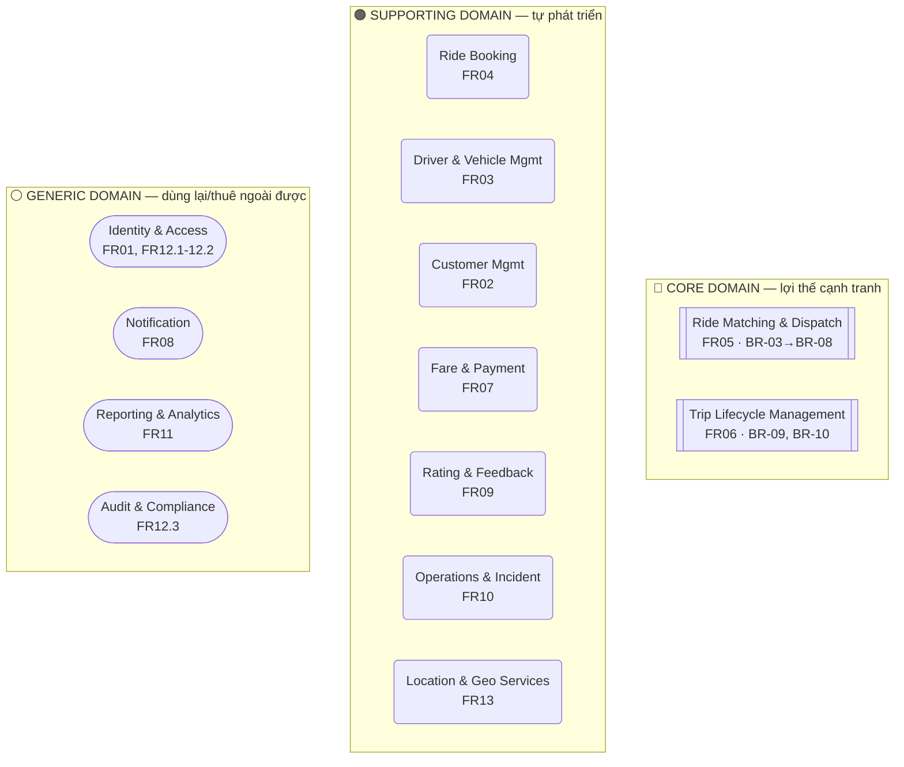

# CAB System – Domain Model (Domain-Driven Design)

> **Dự án:** 23638831_BuiThiDiemMy_cabsystem
> **Tài liệu nguồn tham chiếu:** `README.md` (BA), `openapi.yaml` + `/paths/fr*.yaml` (API), `CAB_System_API_Test_Cases_200` (Test Case)
> **Phương pháp:** Domain-Driven Design – phân rã Subdomain theo **High Cohesion**, liên kết Bounded Context theo **Loose Coupling**

---

## 1. Domain tổng thể (Problem Domain)

> **CAB System** là nền tảng kết nối và điều phối hành khách với tài xế theo thời gian thực, tự động hóa toàn bộ vòng đời một chuyến đi — từ đặt xe, tìm & phân công tài xế, thực hiện chuyến, tính cước, thanh toán, đến thông báo và đánh giá — thay thế quy trình tổng đài/phân công thủ công (AS-IS → TO-BE).

Domain tổng thể này **quá lớn để phát triển như một khối duy nhất** (vi phạm high cohesion: quá nhiều lý do để thay đổi trong cùng một module). Vì vậy được phân rã thành các **Subdomain**, mỗi subdomain sở hữu một tập dữ liệu + quy tắc nghiệp vụ riêng biệt, ánh xạ 1-1 sang một **Bounded Context** (đã thể hiện qua việc mỗi FR có 1 file API `/paths/fr*.yaml` và 1 file schema riêng trong `/components/schemas-*.yaml`).

---

## 2. Phân rã Subdomain theo High Cohesion

Nguyên tắc high cohesion áp dụng: mỗi subdomain **sở hữu trọn vẹn** một nhóm entity + quy tắc nghiệp vụ (Business Rule) của riêng nó, không có subdomain nào ghi (write) vào dữ liệu của subdomain khác.

### 🔴 CORE DOMAIN — lợi thế cạnh tranh cốt lõi của CAB System

| Subdomain | FR / BR liên quan | Dữ liệu & quy tắc sở hữu (Aggregate) | Vì sao high-cohesion |
|---|---|---|---|
| **Ride Matching & Dispatch** | FR05, BR-03→BR-08 (Critical) | `MatchingState`, `MatchingAttempt`, `DriverOffer` — thuật toán ưu tiên tài xế gần, xử lý từ chối/timeout/retry | Toàn bộ logic "ai nhận chuyến này" chỉ nằm ở đây; không context nào khác được quyết định phân công |
| **Trip Lifecycle Management** | FR06, BR-04, BR-09, BR-10 (Critical) | `Trip`, `TripStatus` (máy trạng thái ASSIGNED→…→COMPLETED) | Là nơi **duy nhất** được phép chuyển trạng thái chuyến đi; enforce đúng thứ tự (BR-10) |

Đây là 2 subdomain **CORE** vì đây chính là bài toán khó nhất và tạo khác biệt của một hệ thống CAB (BR02, BR04 được đánh giá **Critical** trong Business Requirements).

### 🟠 SUPPORTING DOMAIN — cần thiết cho nghiệp vụ, tự phát triển trong 7 tuần

| Subdomain | FR liên quan | Dữ liệu & quy tắc sở hữu | Vì sao high-cohesion |
|---|---|---|---|
| **Customer Management** | FR02 | `Customer`, lịch sử chuyến (view) | Chỉ quản lý hồ sơ & lịch sử khách hàng, không đụng tới logic đặt xe |
| **Driver & Vehicle Management** | FR03 | `Driver`, `Vehicle`, `DriverStatus` (BR-03) | Chủ sở hữu duy nhất trạng thái sẵn sàng và hồ sơ phương tiện |
| **Ride Booking** | FR04 | `Booking`, `BookingStatus`, `VehicleType` | Chỉ lo việc tạo/hủy/theo dõi *yêu cầu* đặt xe, không tự tìm tài xế |
| **Fare & Payment** | FR07, BR-11→BR-14 | `Fare`, `Payment`, `PaymentStatus` | Toàn bộ công thức tính cước và vòng đời giao dịch chỉ ở đây |
| **Rating & Feedback** | FR09, BR-16 | `Rating` | Tách riêng khỏi Trip để không làm phình logic chuyến đi |
| **Operations & Incident Mgmt** | FR10 | `Incident` + các view tổng hợp cho Operator | Xử lý sự cố vận hành, không sở hữu dữ liệu nghiệp vụ gốc |
| **Location & Geo Services** | FR13, BR-05, BR-17 | Vị trí realtime tài xế, chỉ số geo-index, ETA | Đóng gói toàn bộ bài toán không gian địa lý (GPS, khoảng cách, ETA) |

### ⚪ GENERIC DOMAIN — phổ biến, có thể mua/dùng lại

| Subdomain | FR liên quan | Dữ liệu & quy tắc sở hữu | Vì sao high-cohesion |
|---|---|---|---|
| **Identity & Access Management** | FR01, FR12.1–12.2, BR-01, BR-02 | `User`, `Role`, credential, token | Xác thực/phân quyền là bài toán chung, tách khỏi mọi nghiệp vụ CAB |
| **Notification** | FR08, BR-15 | `Notification`, kênh gửi | Chỉ biết "gửi gì, cho ai, qua kênh nào" — không hiểu nghiệp vụ CAB |
| **Reporting & Analytics** | FR11 | Các bảng tổng hợp read-only (chuyến, doanh thu, hiệu quả tài xế) | Chỉ đọc & tổng hợp, không có quyền ghi vào bất kỳ subdomain nào |
| **Audit & Compliance** | FR12.3, BR-19 | `AuditLog` | Tách khỏi Identity vì mối quan tâm khác: *ghi vết*, không phải *xác thực* |

**Tổng cộng: 13 subdomain** (2 Core + 7 Supporting + 4 Generic), khớp 1-1 với 13 nhóm Functional Requirement đã đặc tả trong README, chỉ riêng FR12 được tách thành 2 subdomain (Access Management vs Audit) vì hai mối quan tâm khác nhau (authorize vs record).

---

## 3. Domain Map



---

## 4. Bounded Context tương ứng

Mỗi subdomain ở trên = **một Bounded Context độc lập**, đã được hiện thực hóa nhất quán trong bộ tài liệu kỹ thuật:

| Bounded Context | Ubiquitous Language (thuật ngữ riêng) | API contract | Schema riêng |
|---|---|---|---|
| Ride Matching & Dispatch | *offer, attempt, timeout, ưu tiên gần* | `paths/fr05-matching.yaml` | `schemas-booking.yaml` (MatchingState, DriverOffer) |
| Trip Lifecycle Management | *trạng thái chuyến, tracking, ETA hiện tại* | `paths/fr06-trips.yaml` | `schemas-trip.yaml` |
| Ride Booking | *yêu cầu đặt xe, hủy tìm kiếm* | `paths/fr04-bookings.yaml` | `schemas-booking.yaml` (Booking) |
| Driver & Vehicle Mgmt | *tài xế sẵn sàng, hồ sơ xe* | `paths/fr03-drivers.yaml` | `schemas-user.yaml` (Driver, Vehicle) |
| Fare & Payment | *cước, giao dịch, retry* | `paths/fr07-payments.yaml` | `schemas-payment.yaml` |
| ... | ... | `paths/fr0X-*.yaml` | `schemas-*.yaml` |

→ Việc mỗi FR trước đây đã được tách thành **1 file path + 1 file schema riêng** chính là biểu hiện kỹ thuật của ranh giới Bounded Context — mỗi context có "ngôn ngữ" và mô hình dữ liệu của riêng mình, không dùng chung entity với context khác.

---

## 5. Nguyên tắc Loose Coupling giữa các Subdomain

Các subdomain **không được** gọi thẳng vào database của nhau. Toàn bộ liên kết đi qua 4 cơ chế sau:

| Cơ chế | Áp dụng khi nào | Ví dụ trong CAB System |
|---|---|---|
| **Domain Event (Pub/Sub, bất đồng bộ)** | Mặc định cho mọi liên kết giữa 2 context nội bộ | `BookingCreated`, `TripCompleted`, `PaymentSucceeded`… |
| **Open Host Service (API công khai, đồng bộ)** | Khi cần dữ liệu *ngay lập tức* để ra quyết định | Matching gọi `GET /drivers/nearby` (Location context) khi đang tìm tài xế |
| **Anti-Corruption Layer (ACL)** | Khi giao tiếp với hệ thống/NCC bên ngoài | Fare & Payment bọc Payment Provider; Location bọc Map/GPS Provider |
| **Shared Kernel (tối giản)** | Value Object dùng chung, hiếm khi đổi | `Location`, `Money` (đã tách riêng trong `schemas-common.yaml`) |

Quy ước bổ sung để giữ coupling thấp:
- Context tiêu thụ event (Matching, Reporting, Audit…) **tự lưu read-model riêng**, không query ngược lại context nguồn → context nguồn có thể đổi schema nội bộ mà không phá vỡ bên tiêu thụ.
- `Identity & Access` là context duy nhất mọi context khác phải **conform** theo (Conformist) — mọi request đều mang JWT do Identity phát hành; không context nào tự làm xác thực riêng.
- `Reporting & Analytics` và `Audit & Compliance` chỉ **lắng nghe (subscribe)**, không bao giờ publish event ngược lại → đảm bảo one-way dependency, không tạo vòng lặp phụ thuộc.

---

## 6. Context Map

```mermaid
flowchart LR
    AUTH(["Identity & Access"])

    BOOK("Ride Booking")
    MATCH[["Ride Matching<br/>& Dispatch"]]
    TRIP[["Trip Lifecycle<br/>Management"]]
    DRV("Driver & Vehicle Mgmt")
    LOC("Location & Geo Services")
    PAY("Fare & Payment")
    RATE("Rating & Feedback")
    CUST("Customer Mgmt")
    OPS("Operations & Incident")
    NOTI(["Notification"])
    REPT(["Reporting & Analytics"])
    AUDIT(["Audit & Compliance"])

    PP[/"Payment Provider (ngoài)"/]
    MP[/"Map & GPS Provider (ngoài)"/]
    NP[/"Notification Provider (ngoài)"/]

    BOOK -- "event: BookingCreated" --> MATCH
    MATCH -- "cập nhật status ASSIGNED / NO_DRIVER" --> BOOK
    MATCH -- "OHS (sync): GET /drivers/nearby" --> LOC
    DRV -- "event: DriverLocationUpdated" --> LOC
    DRV -- "event: DriverAvailabilityChanged (read-model)" --> MATCH
    MATCH -- "event: DriverOfferAccepted" --> TRIP
    TRIP -- "event: DriverLocationUpdated (tracking)" --> DRV
    TRIP -- "event: TripCompleted" --> PAY
    TRIP -- "event: TripCompleted" --> RATE
    RATE -- "event: RatingSubmitted (cập nhật average)" --> DRV
    PAY -. "ACL: chuẩn hóa webhook thanh toán" .-> PP
    LOC -. "ACL: chuẩn hóa toạ độ/ETA" .-> MP
    NOTI -. "ACL: gửi push/SMS" .-> NP

    TRIP -- "event: TripStuck" --> OPS
    PAY -- "event: PaymentFailed (lặp lại)" --> OPS

    MATCH -- events --> NOTI
    TRIP -- events --> NOTI
    PAY -- events --> NOTI

    MATCH -- events --> REPT
    TRIP -- events --> REPT
    PAY -- events --> REPT
    OPS -- events --> REPT

    BOOK -- events --> AUDIT
    PAY -- events --> AUDIT
    AUTH -- "event: RoleAssigned" --> AUDIT

    AUTH -. "Conformist: mọi context xác thực bằng JWT do Identity phát hành" .-> BOOK
    AUTH -. "" .-> MATCH
    AUTH -. "" .-> TRIP
    AUTH -. "" .-> PAY
    AUTH -. "" .-> DRV
    AUTH -. "" .-> CUST
    AUTH -. "" .-> OPS
```

*Ghi chú ký hiệu:* mũi tên liền (`-->`) = liên kết nghiệp vụ (event bất đồng bộ hoặc gọi API đồng bộ); mũi tên chấm (`-.->`) = quan hệ hạ tầng/ràng buộc (ACL với bên ngoài, Conformist với Identity).

---

## 7. Luồng Domain Event chính (theo quy trình nghiệp vụ lõi)

Bám theo quy trình đã xác lập trong README: **Đặt xe → Tìm tài xế → Phân công → Thực hiện chuyến → Tính cước → Thanh toán → Thông báo → Đánh giá → Báo cáo**

| # | Domain Event | Producer | Consumer(s) | Business Rule liên quan |
|---|---|---|---|---|
| 1 | `BookingCreated` | Ride Booking | Ride Matching, Reporting, Audit | BR-04 |
| 2 | `DriverOfferSent` | Ride Matching | Notification | BR-06, BR-07 |
| 3 | `DriverOfferAccepted` | Ride Matching | Trip Lifecycle, Ride Booking, Notification | — |
| 4 | `DriverOfferRejected` / `DriverOfferExpired` | Ride Matching | Ride Matching (tự retry), Reporting | BR-06, BR-07 |
| 5 | `NoDriverFound` | Ride Matching | Ride Booking, Notification, Operations | BR-08 |
| 6 | `DriverLocationUpdated` | Driver & Vehicle Mgmt | Location & Geo, Trip Lifecycle | BR-17 |
| 7 | `TripStatusChanged` | Trip Lifecycle | Notification, Ride Booking, Operations | BR-09, BR-10 |
| 8 | `TripCompleted` | Trip Lifecycle | Fare & Payment, Rating & Feedback, Reporting, Audit | BR-04 |
| 9 | `PaymentSucceeded` / `PaymentFailed` | Fare & Payment | Notification, Trip Lifecycle, Operations, Reporting | BR-12→BR-14 |
| 10 | `RatingSubmitted` | Rating & Feedback | Driver & Vehicle Mgmt (cập nhật averageRating), Reporting | BR-16 |
| 11 | `IncidentReported` / `IncidentResolved` | Operations | Notification, Reporting | — |
| 12 | *(mọi event có ảnh hưởng nghiệp vụ)* | Tất cả context | Audit & Compliance | BR-19 |

---

## 8. Vì sao thiết kế này high-cohesion + loosely-coupled

**High cohesion (bên trong mỗi subdomain):**
- Mỗi Aggregate Root (`Booking`, `Trip`, `DriverOffer`, `Payment`…) chỉ có **một chủ sở hữu ghi (single writer)** — không có 2 context nào cùng update một bảng.
- Business Rule (BR-xx) luôn được enforce **tại đúng subdomain sở hữu dữ liệu** đó (vd: BR-10 thứ tự trạng thái chỉ được kiểm tra trong Trip Lifecycle, không rải rác ở nơi khác).

**Loose coupling (giữa các subdomain):**
- Liên kết mặc định là **event bất đồng bộ**, không có transaction phân tán (distributed transaction) xuyên context.
- Context chỉ lộ ra **API/Event hợp đồng** (Published Language), giấu kín mô hình dữ liệu nội bộ — cho phép đổi công nghệ/schema nội bộ của một context (vd. đổi thuật toán matching) mà không ảnh hưởng context khác.
- 3 điểm tích hợp với bên thứ ba (Payment/Map/Notification Provider) đều đi qua **Anti-Corruption Layer**, cô lập rủi ro khi NCC đổi API (đúng như BR-07 "có thể thay đổi/bổ sung nhà cung cấp trong tương lai").
- `Reporting` và `Audit` là **generic subdomain chỉ đọc (one-way subscriber)** — có thể tách thành dịch vụ/đội riêng hoặc thay thế bằng công cụ có sẵn (vd. một BI tool) mà không đụng tới các context nghiệp vụ lõi.

---

## 9. Vấn đề mở cần BA/Kiến trúc sư xác nhận thêm

| Vấn đề | Ảnh hưởng đến domain model |
|---|---|
| Có tách `Location & Geo Services` thành context riêng hay nhúng vào `Driver & Vehicle Mgmt`? | Ảnh hưởng độ phức tạp triển khai trong 7 tuần MVP — có thể gộp tạm ở giai đoạn đầu, tách sau khi cần scale (BR-25) |
| `Fare & Payment` có nên tách thành 2 context (Pricing vs Payment Transaction)? | Hiện gộp theo FR07; nếu công thức tính cước (BR-21) phức tạp dần, nên tách để giữ cohesion |
| Event broker dùng công nghệ gì (Kafka/RabbitMQ/SQS)? | Không ảnh hưởng domain model nhưng ảnh hưởng khả năng đảm bảo BR-13 "không mất dữ liệu giao dịch" |
