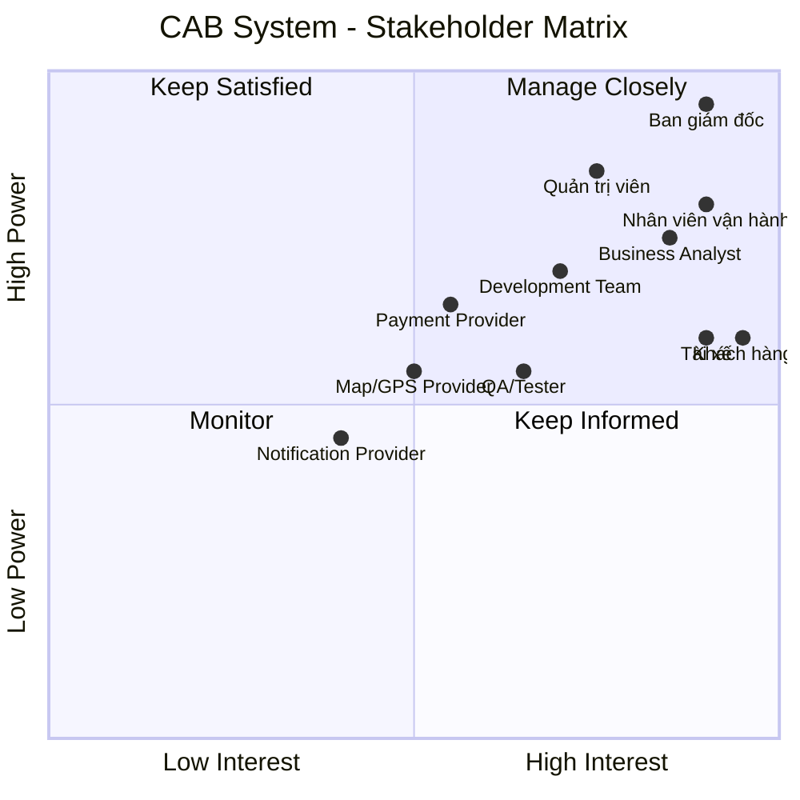
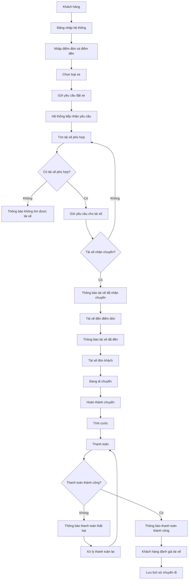
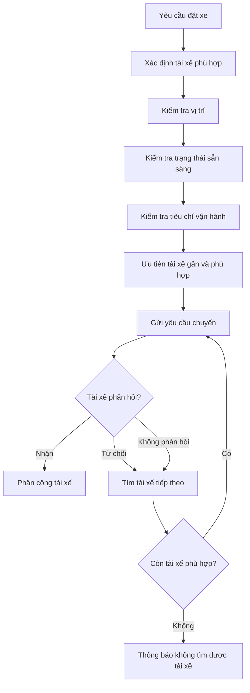
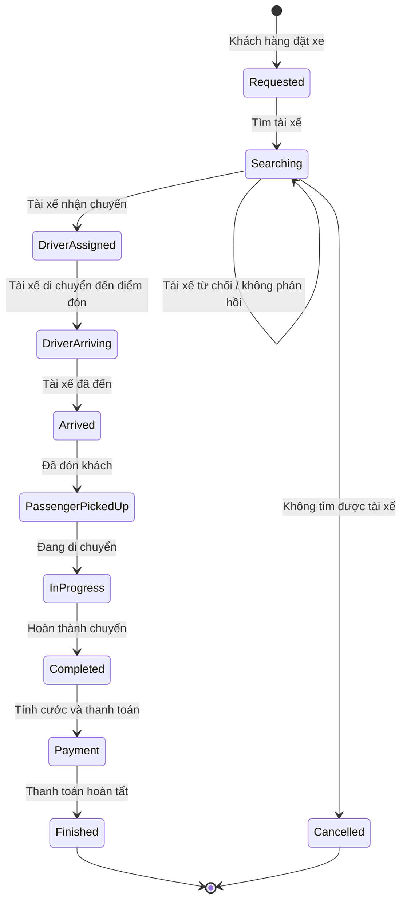
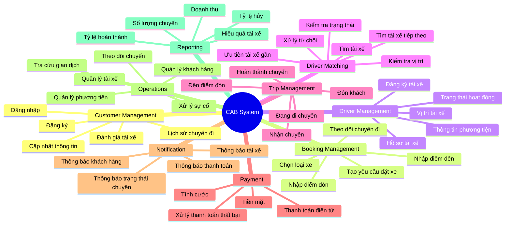
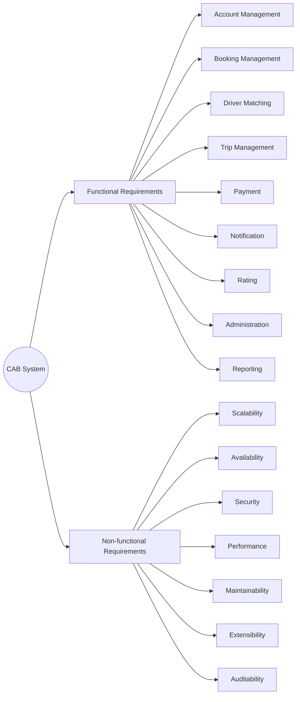
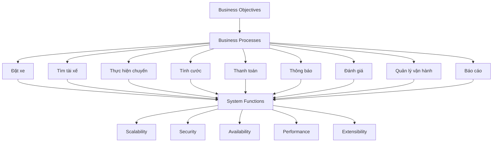
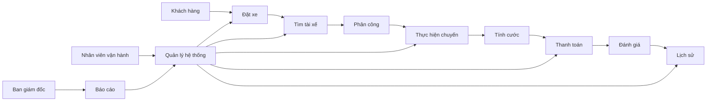

# 23638831_BuiThiDiemMy_cabsystem
# Dự án xây dựng hệ thống CAB System – Nền tảng đặt xe
## 1. Các bên liên quan

## 1. Các bên liên quan

| Các bên liên quan (Stakeholders) | Vai trò (Role) | Tầm quan trọng |
|---|---|---|
| **Ban giám đốc (Management)** | Đưa ra mục tiêu, định hướng, ngân sách và phê duyệt các yêu cầu chính của hệ thống | **Rất cao** |
| **Khách hàng (Customer)** | Đăng ký, đặt xe, theo dõi chuyến đi, thanh toán, xem lịch sử và đánh giá tài xế | **Rất cao** |
| **Tài xế (Driver)** | Nhận/từ chối chuyến, cập nhật trạng thái chuyến, thông tin phương tiện và vị trí | **Rất cao** |
| **Nhân viên vận hành (Operations Staff)** | Quản lý khách hàng, tài xế, phương tiện, chuyến đi và xử lý sự cố | **Rất cao** |
| **Quản trị viên hệ thống (System Administrator)** | Quản lý tài khoản, phân quyền, cấu hình và bảo mật hệ thống | **Cao** |
| **Business Analyst (BA)** | Thu thập, phân tích, làm rõ và đặc tả yêu cầu | **Cao** |
| **Nhóm phát triển (Development Team)** | Thiết kế, xây dựng, tích hợp và triển khai hệ thống | **Cao** |
| **Nhóm kiểm thử (QA/Tester)** | Kiểm thử chức năng, hiệu năng, bảo mật và độ ổn định | **Cao** |
| **Nhà cung cấp thanh toán (Payment Provider)** | Xử lý các giao dịch thanh toán điện tử | **Cao** |
| **Nhà cung cấp bản đồ/GPS (Map & GPS Provider)** | Cung cấp dữ liệu vị trí, khoảng cách và hỗ trợ tìm tài xế | **Cao** |
| **Nhà cung cấp thông báo (Notification Provider)** | Gửi thông báo đến khách hàng và tài xế | **Trung bình – Cao** |
## 2. Stakeholder Matrix



---

---

## 3. Stakeholder quan trọng nhất

| Stakeholder | Mức độ quan trọng | Lý do |
|---|---|---|
| **Management** | ⭐⭐⭐⭐⭐ | Có quyền quyết định và phê duyệt dự án |
| **Customer** | ⭐⭐⭐⭐⭐ | Người sử dụng dịch vụ đặt xe |
| **Driver** | ⭐⭐⭐⭐⭐ | Người trực tiếp thực hiện chuyến xe |
| **Operations Staff** | ⭐⭐⭐⭐⭐ | Quản lý và xử lý hoạt động vận hành |
| **System Administrator** | ⭐⭐⭐⭐ | Quản lý hệ thống, tài khoản và phân quyền |
| **Business Analyst** | ⭐⭐⭐⭐ | Phân tích và làm rõ yêu cầu |
| **Development Team** | ⭐⭐⭐⭐ | Xây dựng hệ thống |
| **QA/Tester** | ⭐⭐⭐⭐ | Đảm bảo chất lượng hệ thống |
| **Payment Provider** | ⭐⭐⭐⭐ | Xử lý thanh toán điện tử |
| **Map/GPS Provider** | ⭐⭐⭐⭐ | Hỗ trợ định vị và tìm tài xế |
| **Notification Provider** | ⭐⭐⭐ | Hỗ trợ gửi thông báo |

# Customer and System Expectations

## 1. Customer Expectations

- **Easy booking:** Khách hàng có thể đăng ký, đăng nhập, nhập điểm đón, điểm đến và chọn loại xe.
- **Trip tracking:** Khách hàng có thể theo dõi trạng thái chuyến đi.
- **Fast driver matching:** Hệ thống tìm tài xế phù hợp và gần khách hàng.
- **Automatic re-matching:** Nếu tài xế từ chối hoặc không phản hồi, hệ thống tiếp tục tìm tài xế khác.
- **Clear notification:** Khách hàng được thông báo khi có tài xế, tài xế đến, chuyến hoàn thành và thanh toán.
- **Flexible payment:** Hỗ trợ thanh toán tiền mặt và thanh toán điện tử.
- **Trip history:** Khách hàng có thể xem lịch sử chuyến đi và số tiền phải trả.
- **Driver rating:** Khách hàng có thể đánh giá tài xế sau chuyến đi.
- **Data security:** Thông tin cá nhân, vị trí và giao dịch được bảo vệ.

## 2. System Expectations

- **Scalability:** Phục vụ số lượng lớn khách hàng và tài xế.
- **Automatic driver matching:** Tự động tìm và ưu tiên tài xế phù hợp.
- **Trip management:** Quản lý toàn bộ trạng thái chuyến đi.
- **Fare and payment management:** Tính cước và hỗ trợ nhiều phương thức thanh toán.
- **Third-party integration:** Có khả năng tích hợp với các nhà cung cấp bên ngoài.
- **Independent scalability:** Các thành phần có thể mở rộng độc lập.
- **High availability:** Lỗi ở một thành phần không làm toàn bộ hệ thống ngừng hoạt động.
- **Security:** Xác thực, phân quyền và bảo vệ dữ liệu.
- **Audit logging:** Lưu vết các thao tác quan trọng.
- **Administration:** Hỗ trợ nhân viên vận hành quản lý hệ thống.
- **Reporting:** Cung cấp báo cáo về chuyến đi, doanh thu, tỷ lệ hoàn thành và hủy chuyến.
- **Future extensibility:** Có thể thêm dịch vụ, phương thức thanh toán và nhà cung cấp mới.


# CAB System – Mục đích nghiệp vụ và yêu cầu hệ thống

## 1. Mục đích của nghiệp vụ

Xây dựng hệ thống **CAB System** nhằm tự động hóa và quản lý toàn bộ quy trình đặt xe, từ khi khách hàng tạo yêu cầu đến khi chuyến đi hoàn thành, thanh toán và đánh giá.

### Mục tiêu cụ thể

- Tự động hóa việc tìm kiếm và phân công tài xế.
- Giảm sự phụ thuộc vào việc phân công tài xế thủ công.
- Giúp khách hàng đặt xe và theo dõi chuyến đi dễ dàng.
- Quản lý tập trung khách hàng, tài xế, phương tiện, chuyến đi và giao dịch.
- Hỗ trợ thanh toán bằng tiền mặt và phương thức điện tử.
- Cung cấp thông báo kịp thời cho khách hàng và tài xế.
- Hỗ trợ nhân viên vận hành quản lý và xử lý sự cố.
- Cung cấp báo cáo về hoạt động kinh doanh.
- Đảm bảo hệ thống bảo mật, ổn định và có khả năng mở rộng.
- Cho phép bổ sung các tính năng mới trong tương lai.

---

# 2. Nghiệp vụ cần làm những gì?

## 2.1. Quản lý khách hàng

- Đăng ký tài khoản.
- Đăng nhập.
- Cập nhật thông tin cá nhân.
- Xem lịch sử chuyến đi.
- Xem số tiền phải trả.
- Đánh giá tài xế sau khi hoàn thành chuyến.

## 2.2. Đặt xe

- Nhập điểm đón.
- Nhập điểm đến.
- Lựa chọn loại xe/dịch vụ.
- Gửi yêu cầu đặt xe.
- Theo dõi trạng thái yêu cầu đặt xe.

## 2.3. Tìm và phân công tài xế

- Xác định các tài xế phù hợp.
- Kiểm tra vị trí của tài xế.
- Kiểm tra trạng thái sẵn sàng của tài xế.
- Áp dụng các tiêu chí vận hành.
- Ưu tiên tài xế phù hợp và gần khách hàng.
- Gửi yêu cầu chuyến đi cho tài xế.
- Nếu tài xế không phản hồi hoặc từ chối, tiếp tục tìm tài xế khác.
- Nếu không tìm được tài xế, thông báo cho khách hàng.

## 2.4. Thực hiện chuyến đi

Tài xế cập nhật trạng thái chuyến:

```text
Đã nhận chuyến
      ↓
Đã đến điểm đón
      ↓
Đã đón khách
      ↓
Đang di chuyển
      ↓
Hoàn thành chuyến


# CAB System – Business Process

## 1. Mục đích nghiệp vụ

Mục đích của CAB System là tự động hóa và quản lý toàn bộ quy trình đặt xe:

- Khách hàng tạo yêu cầu đặt xe.
- Hệ thống tìm và phân công tài xế.
- Tài xế thực hiện chuyến đi.
- Hệ thống tính cước và thanh toán.
- Hệ thống gửi thông báo.
- Khách hàng đánh giá tài xế.
- Doanh nghiệp quản lý và báo cáo hoạt động.

---

## 2. Quy trình nghiệp vụ chính



---

# 3. Quy trình tìm và phân công tài xế



---

# 4. Quy trình thực hiện chuyến đi



---

# 5. Các nhóm chức năng hệ thống



---

# 6. Hệ thống cần đáp ứng



---

# 7. Mối quan hệ giữa nghiệp vụ và hệ thống



## 8. Tóm tắt


