# 23638831_BuiThiDiemMy_cabsystem
# Dự án xây dựng hệ thống CAB System – Nền tảng đặt xe
## 1. Các bên liên quan

## 1. Các bên liên quan

| Các bên liên quan (Stakeholders) | Vai trò (Role) | Tầm quan trọng |
|---|---|---|
| **Ban giám đốc (Management)** | Đưa ra mục tiêu, định hướng, ngân sách và phê duyệt các yêu cầu chính của hệ thống | **Rất cao** |
| **Khách hàng (Customer)** | Đăng ký, đặt xe, theo dõi chuyến đi, thanh toán, xem lịch sử và đánh giá tài xế | **Rất cao** |
| **Tài xế (Driver)** | Nhận/từ chối chuyến, cập nhật trạng thái chuyến, thông tin phương tiện và vị trí | **Rất cao** |
| **Nhân viên vận hành (Operations Staff)** | Quản lý khách hàng, tài xế, phương tiện, chuyến đi và xử lý sự cố | **Rất cao** |
| **Quản trị viên hệ thống (System Administrator)** | Quản lý tài khoản, phân quyền, cấu hình và bảo mật hệ thống | **Cao** |
| **Business Analyst (BA)** | Thu thập, phân tích, làm rõ và đặc tả yêu cầu | **Cao** |
| **Nhóm phát triển (Development Team)** | Thiết kế, xây dựng, tích hợp và triển khai hệ thống | **Cao** |
| **Nhóm kiểm thử (QA/Tester)** | Kiểm thử chức năng, hiệu năng, bảo mật và độ ổn định | **Cao** |
| **Nhà cung cấp thanh toán (Payment Provider)** | Xử lý các giao dịch thanh toán điện tử | **Cao** |
| **Nhà cung cấp bản đồ/GPS (Map & GPS Provider)** | Cung cấp dữ liệu vị trí, khoảng cách và hỗ trợ tìm tài xế | **Cao** |
| **Nhà cung cấp thông báo (Notification Provider)** | Gửi thông báo đến khách hàng và tài xế | **Trung bình – Cao** |
## 2. Stakeholder Matrix

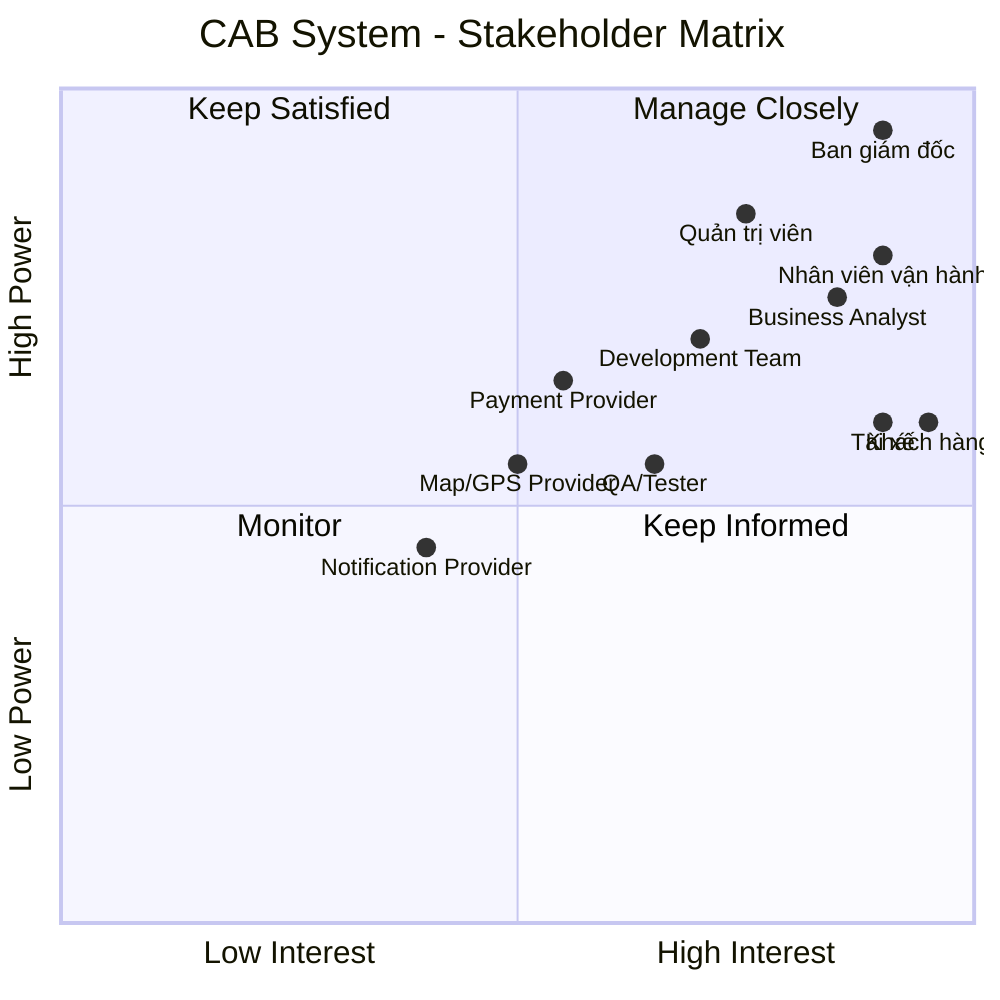

---

---

## 3. Stakeholder quan trọng nhất

| Stakeholder | Mức độ quan trọng | Lý do |
|---|---|---|
| **Management** | ⭐⭐⭐⭐⭐ | Có quyền quyết định và phê duyệt dự án |
| **Customer** | ⭐⭐⭐⭐⭐ | Người sử dụng dịch vụ đặt xe |
| **Driver** | ⭐⭐⭐⭐⭐ | Người trực tiếp thực hiện chuyến xe |
| **Operations Staff** | ⭐⭐⭐⭐⭐ | Quản lý và xử lý hoạt động vận hành |
| **System Administrator** | ⭐⭐⭐⭐ | Quản lý hệ thống, tài khoản và phân quyền |
| **Business Analyst** | ⭐⭐⭐⭐ | Phân tích và làm rõ yêu cầu |
| **Development Team** | ⭐⭐⭐⭐ | Xây dựng hệ thống |
| **QA/Tester** | ⭐⭐⭐⭐ | Đảm bảo chất lượng hệ thống |
| **Payment Provider** | ⭐⭐⭐⭐ | Xử lý thanh toán điện tử |
| **Map/GPS Provider** | ⭐⭐⭐⭐ | Hỗ trợ định vị và tìm tài xế |
| **Notification Provider** | ⭐⭐⭐ | Hỗ trợ gửi thông báo |

# Customer and System Expectations

## 1. Customer Expectations

- **Easy booking:** Khách hàng có thể đăng ký, đăng nhập, nhập điểm đón, điểm đến và chọn loại xe.
- **Trip tracking:** Khách hàng có thể theo dõi trạng thái chuyến đi.
- **Fast driver matching:** Hệ thống tìm tài xế phù hợp và gần khách hàng.
- **Automatic re-matching:** Nếu tài xế từ chối hoặc không phản hồi, hệ thống tiếp tục tìm tài xế khác.
- **Clear notification:** Khách hàng được thông báo khi có tài xế, tài xế đến, chuyến hoàn thành và thanh toán.
- **Flexible payment:** Hỗ trợ thanh toán tiền mặt và thanh toán điện tử.
- **Trip history:** Khách hàng có thể xem lịch sử chuyến đi và số tiền phải trả.
- **Driver rating:** Khách hàng có thể đánh giá tài xế sau chuyến đi.
- **Data security:** Thông tin cá nhân, vị trí và giao dịch được bảo vệ.

## 2. System Expectations

- **Scalability:** Phục vụ số lượng lớn khách hàng và tài xế.
- **Automatic driver matching:** Tự động tìm và ưu tiên tài xế phù hợp.
- **Trip management:** Quản lý toàn bộ trạng thái chuyến đi.
- **Fare and payment management:** Tính cước và hỗ trợ nhiều phương thức thanh toán.
- **Third-party integration:** Có khả năng tích hợp với các nhà cung cấp bên ngoài.
- **Independent scalability:** Các thành phần có thể mở rộng độc lập.
- **High availability:** Lỗi ở một thành phần không làm toàn bộ hệ thống ngừng hoạt động.
- **Security:** Xác thực, phân quyền và bảo vệ dữ liệu.
- **Audit logging:** Lưu vết các thao tác quan trọng.
- **Administration:** Hỗ trợ nhân viên vận hành quản lý hệ thống.
- **Reporting:** Cung cấp báo cáo về chuyến đi, doanh thu, tỷ lệ hoàn thành và hủy chuyến.
- **Future extensibility:** Có thể thêm dịch vụ, phương thức thanh toán và nhà cung cấp mới.


# CAB System – Mục đích nghiệp vụ và yêu cầu hệ thống

## 1. Mục đích của nghiệp vụ

Xây dựng hệ thống **CAB System** nhằm tự động hóa và quản lý toàn bộ quy trình đặt xe, từ khi khách hàng tạo yêu cầu đến khi chuyến đi hoàn thành, thanh toán và đánh giá.

### Mục tiêu cụ thể

- Tự động hóa việc tìm kiếm và phân công tài xế.
- Giảm sự phụ thuộc vào việc phân công tài xế thủ công.
- Giúp khách hàng đặt xe và theo dõi chuyến đi dễ dàng.
- Quản lý tập trung khách hàng, tài xế, phương tiện, chuyến đi và giao dịch.
- Hỗ trợ thanh toán bằng tiền mặt và phương thức điện tử.
- Cung cấp thông báo kịp thời cho khách hàng và tài xế.
- Hỗ trợ nhân viên vận hành quản lý và xử lý sự cố.
- Cung cấp báo cáo về hoạt động kinh doanh.
- Đảm bảo hệ thống bảo mật, ổn định và có khả năng mở rộng.
- Cho phép bổ sung các tính năng mới trong tương lai.

---

# 2. Nghiệp vụ cần làm những gì?

## 2.1. Quản lý khách hàng

- Đăng ký tài khoản.
- Đăng nhập.
- Cập nhật thông tin cá nhân.
- Xem lịch sử chuyến đi.
- Xem số tiền phải trả.
- Đánh giá tài xế sau khi hoàn thành chuyến.

## 2.2. Đặt xe

- Nhập điểm đón.
- Nhập điểm đến.
- Lựa chọn loại xe/dịch vụ.
- Gửi yêu cầu đặt xe.
- Theo dõi trạng thái yêu cầu đặt xe.

## 2.3. Tìm và phân công tài xế

- Xác định các tài xế phù hợp.
- Kiểm tra vị trí của tài xế.
- Kiểm tra trạng thái sẵn sàng của tài xế.
- Áp dụng các tiêu chí vận hành.
- Ưu tiên tài xế phù hợp và gần khách hàng.
- Gửi yêu cầu chuyến đi cho tài xế.
- Nếu tài xế không phản hồi hoặc từ chối, tiếp tục tìm tài xế khác.
- Nếu không tìm được tài xế, thông báo cho khách hàng.

## 2.4. Thực hiện chuyến đi

Tài xế cập nhật trạng thái chuyến:

```text
Đã nhận chuyến
      ↓
Đã đến điểm đón
      ↓
Đã đón khách
      ↓
Đang di chuyển
      ↓
Hoàn thành chuyến


# CAB System – Business Process

## 1. Mục đích nghiệp vụ

Mục đích của CAB System là tự động hóa và quản lý toàn bộ quy trình đặt xe:

- Khách hàng tạo yêu cầu đặt xe.
- Hệ thống tìm và phân công tài xế.
- Tài xế thực hiện chuyến đi.
- Hệ thống tính cước và thanh toán.
- Hệ thống gửi thông báo.
- Khách hàng đánh giá tài xế.
- Doanh nghiệp quản lý và báo cáo hoạt động.

---

## 2. Quy trình nghiệp vụ chính

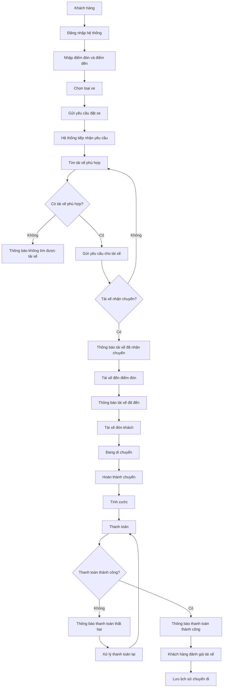

---

# 3. Quy trình tìm và phân công tài xế

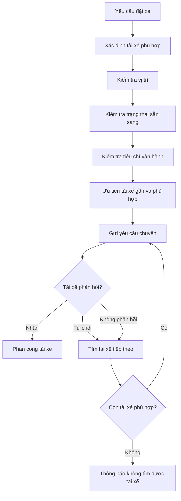

---

# 4. Quy trình thực hiện chuyến đi

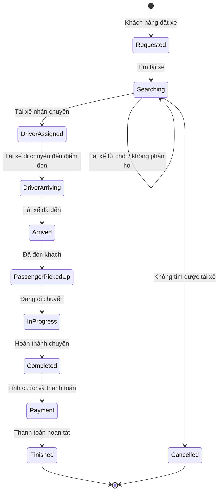

---

# 5. Các nhóm chức năng hệ thống

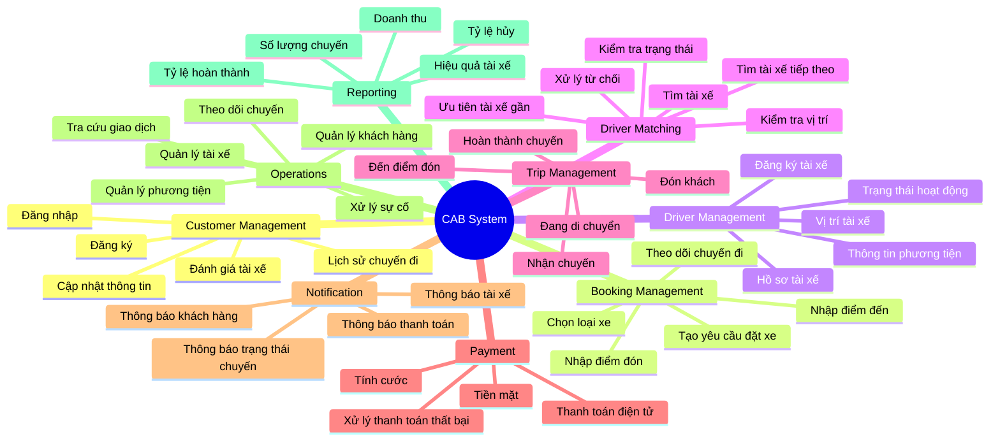

---

# 6. Hệ thống cần đáp ứng

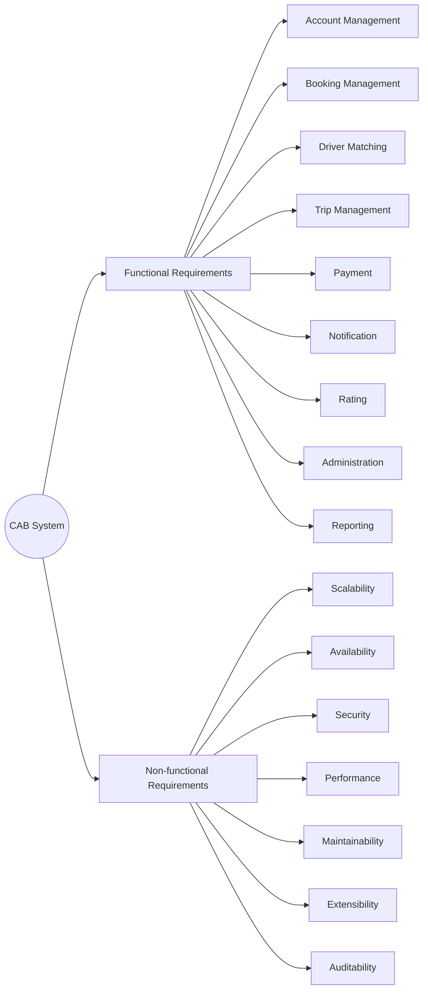

---

# 7. Mối quan hệ giữa nghiệp vụ và hệ thống

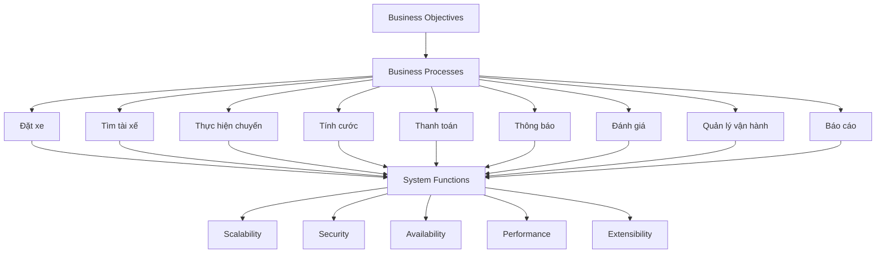

## 8. Tóm tắt

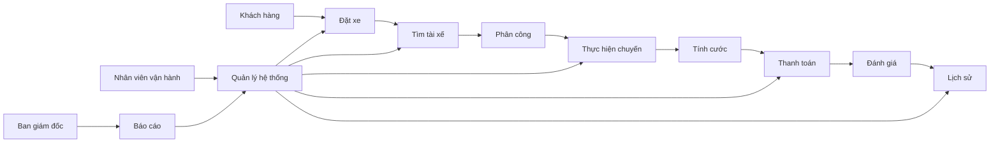
## 2. Phạm vi dự án trong 7 tuần

Do thời gian xây dựng và triển khai chỉ có **7 tuần**, dự án tập trung vào những chức năng **cơ bản, quan trọng và cần thiết nhất** để hệ thống CAB có thể vận hành quy trình chính:

**Đặt xe → Tìm tài xế → Phân công → Thực hiện chuyến → Tính cước → Thanh toán → Hoàn thành**

---

## 2.1. Trong phạm vi (In Scope)

| STT | Phạm vi chính | Chức năng |
|---|---|---|
| 1 | **Quản lý tài khoản** | Đăng ký, đăng nhập và cập nhật thông tin cá nhân |
| 2 | **Đặt xe** | Nhập điểm đón, điểm đến, chọn loại xe và gửi yêu cầu đặt xe |
| 3 | **Tìm tài xế** | Tìm tài xế phù hợp dựa trên vị trí và trạng thái sẵn sàng |
| 4 | **Phân công tài xế** | Gửi yêu cầu cho tài xế, chấp nhận/từ chối và tìm tài xế khác nếu cần |
| 5 | **Quản lý chuyến đi** | Tài xế cập nhật trạng thái: đã đến, đã đón khách, đang di chuyển, hoàn thành |
| 6 | **Theo dõi chuyến đi** | Khách hàng theo dõi trạng thái chuyến, thông tin tài xế và thời gian dự kiến đến |
| 7 | **Tính cước** | Tính số tiền khách hàng phải trả sau khi hoàn thành chuyến |
| 8 | **Thanh toán** | Thanh toán tiền mặt và một phương thức thanh toán điện tử |
| 9 | **Thông báo** | Thông báo cho khách hàng và tài xế về các sự kiện quan trọng |
| 10 | **Đánh giá tài xế** | Khách hàng đánh giá tài xế sau khi hoàn thành chuyến |
| 11 | **Quản lý vận hành** | Quản lý khách hàng, tài xế, phương tiện và chuyến đi |
| 12 | **Xử lý sự cố** | Theo dõi chuyến đang diễn ra và hỗ trợ các trường hợp chuyến bị lỗi |
| 13 | **Phân quyền** | Phân quyền cơ bản cho nhân viên vận hành và quản trị viên |
| 14 | **Báo cáo cơ bản** | Báo cáo số chuyến, doanh thu, tỷ lệ hoàn thành và tỷ lệ hủy |
| 15 | **Bảo mật và lưu vết** | Xác thực người dùng, kiểm soát quyền truy cập và lưu log các thao tác quan trọng |

---

## 2.2. Ngoài phạm vi (Out of Scope)

Do thời gian thực hiện chỉ **7 tuần**, các chức năng không ảnh hưởng trực tiếp đến quy trình đặt xe cốt lõi sẽ chưa được triển khai trong phiên bản đầu tiên.

| STT | Chức năng ngoài phạm vi | Lý do |
|---|---|---|
| 1 | **Khuyến mãi/Voucher** | Không ảnh hưởng đến quy trình đặt xe cơ bản |
| 2 | **Tích điểm thành viên** | Chức năng mở rộng, chưa cần thiết |
| 3 | **Thành viên VIP/Loyalty** | Có thể phát triển ở giai đoạn sau |
| 4 | **Chat giữa khách hàng và tài xế** | Không phải chức năng bắt buộc |
| 5 | **Đặt xe theo lịch** | Chưa cần thiết cho phiên bản đầu tiên |
| 6 | **Nhiều phương thức thanh toán điện tử** | Chỉ cần tích hợp một phương thức trong MVP |
| 7 | **Nhiều nhà cung cấp thông báo** | Chỉ cần một kênh thông báo cơ bản |
| 8 | **AI dự đoán nhu cầu** | Không phải chức năng cốt lõi |
| 9 | **AI tối ưu phân tài xế** | Giai đoạn đầu sử dụng quy tắc phân tài xế cơ bản |
| 10 | **Phân tích dữ liệu nâng cao** | Chưa cần thiết trong giai đoạn đầu |
| 11 | **Hỗ trợ nhiều quốc gia/ngôn ngữ** | Không thuộc phạm vi MVP |
| 12 | **Các loại dịch vụ đặt xe nâng cao** | Có thể phát triển trong tương lai |

---
## 3. Phân chia các Module theo 7 tuần

| Tuần | Module | Nội dung chính |
|---|---|---|
| **Tuần 1** | **Account & User Management** | Đăng ký, đăng nhập, quản lý thông tin khách hàng/tài xế và phân quyền cơ bản |
| **Tuần 2** | **Driver & Vehicle Management** | Quản lý tài xế, phương tiện, trạng thái sẵn sàng và vị trí tài xế |
| **Tuần 3** | **Ride Booking** | Nhập điểm đón, điểm đến, chọn loại xe và tạo yêu cầu đặt xe |
| **Tuần 4** | **Driver Matching & Ride Management** | Tìm tài xế, phân công, nhận/từ chối chuyến và cập nhật trạng thái chuyến |
| **Tuần 5** | **Fare & Payment** | Tính cước, thanh toán tiền mặt, thanh toán điện tử và xử lý thanh toán thất bại |
| **Tuần 6** | **Notification & Operation Management** | Gửi thông báo, theo dõi chuyến, quản lý khách hàng/tài xế/chuyến đi và xử lý sự cố |
| **Tuần 7** | **Reporting, Testing & Deployment** | Báo cáo cơ bản, kiểm thử, sửa lỗi, bảo mật và triển khai hệ thống |


# CAB System – Business Requirements

## 1. Tổng quan

Business Requirements mô tả **doanh nghiệp muốn đạt được điều gì** khi xây dựng CAB System.

Các yêu cầu được xác định từ đề bài gồm:

---

## BR01 – Tự động hóa quy trình đặt xe

**Business Requirement:**

> Hệ thống phải giúp doanh nghiệp tự động hóa quy trình đặt xe, từ khi khách hàng tạo yêu cầu đến khi chuyến đi hoàn thành.

**Mục tiêu kinh doanh:**

- Giảm sự phụ thuộc vào tổng đài.
- Giảm việc phân công tài xế thủ công.
- Tăng tốc độ xử lý yêu cầu đặt xe.
- Nâng cao trải nghiệm khách hàng.

---

## BR02 – Tự động tìm và phân công tài xế

**Business Requirement:**

> Hệ thống phải hỗ trợ doanh nghiệp tự động tìm và phân công tài xế phù hợp dựa trên vị trí, trạng thái sẵn sàng và các tiêu chí vận hành.

**Mục tiêu kinh doanh:**

- Giảm thời gian tìm tài xế.
- Tăng hiệu quả sử dụng tài xế.
- Ưu tiên tài xế phù hợp và gần khách hàng.
- Giảm thao tác thủ công của nhân viên vận hành.

---

## BR03 – Đảm bảo khả năng phục vụ khách hàng và tài xế ở quy mô lớn

**Business Requirement:**

> Hệ thống phải có khả năng phục vụ số lượng lớn khách hàng và tài xế, đặc biệt trong thời điểm nhu cầu tăng cao.

**Mục tiêu kinh doanh:**

- Đáp ứng nhu cầu tăng trưởng.
- Hạn chế tình trạng hệ thống quá tải.
- Hỗ trợ doanh nghiệp mở rộng dịch vụ.

---

## BR04 – Quản lý toàn bộ vòng đời chuyến đi

**Business Requirement:**

> Hệ thống phải hỗ trợ doanh nghiệp quản lý toàn bộ quá trình của một chuyến đi từ lúc tạo yêu cầu, tìm tài xế, nhận chuyến, thực hiện chuyến đến khi hoàn thành.

**Mục tiêu kinh doanh:**

- Theo dõi chính xác trạng thái chuyến.
- Giảm sai sót trong vận hành.
- Cung cấp thông tin minh bạch cho khách hàng và tài xế.

---

## BR05 – Cung cấp thông tin và trạng thái chuyến đi theo thời gian thực

**Business Requirement:**

> Hệ thống phải cung cấp thông tin về trạng thái chuyến đi và vị trí tài xế để khách hàng và bộ phận vận hành có thể theo dõi chuyến.

**Mục tiêu kinh doanh:**

- Nâng cao trải nghiệm khách hàng.
- Giúp khách hàng biết thời gian dự kiến tài xế đến.
- Hỗ trợ nhân viên vận hành giám sát chuyến đi.
- Nâng cao khả năng điều phối.

---

## BR06 – Hỗ trợ tính cước và thanh toán

**Business Requirement:**

> Hệ thống phải hỗ trợ doanh nghiệp quản lý việc tính cước và thanh toán cho các chuyến đi.

**Mục tiêu kinh doanh:**

- Tự động hóa việc tính tiền.
- Hỗ trợ thanh toán tiền mặt và điện tử.
- Quản lý tập trung thông tin giao dịch.
- Giảm sai sót trong quá trình thanh toán.

---

## BR07 – Tích hợp với các dịch vụ bên ngoài

**Business Requirement:**

> Hệ thống phải có khả năng tích hợp với các nhà cung cấp dịch vụ bên ngoài như thanh toán, bản đồ/GPS và thông báo.

**Mục tiêu kinh doanh:**

- Giảm việc xây dựng lại các dịch vụ đã có.
- Tăng khả năng mở rộng.
- Có thể thay đổi hoặc bổ sung nhà cung cấp trong tương lai.

---

## BR08 – Cung cấp hệ thống thông báo

**Business Requirement:**

> Hệ thống phải đảm bảo khách hàng và tài xế nhận được thông tin quan trọng trong quá trình đặt và thực hiện chuyến đi.

**Mục tiêu kinh doanh:**

- Cải thiện khả năng giao tiếp giữa hệ thống, khách hàng và tài xế.
- Giảm tình trạng bỏ lỡ thông tin.
- Tăng tính minh bạch của quá trình vận hành.

---

## BR09 – Hỗ trợ quản lý và vận hành tập trung

**Business Requirement:**

> Hệ thống phải cung cấp khả năng quản lý tập trung khách hàng, tài xế, phương tiện, chuyến đi và giao dịch cho bộ phận vận hành.

**Mục tiêu kinh doanh:**

- Nâng cao hiệu quả quản lý.
- Giảm thao tác thủ công.
- Hỗ trợ xử lý các trường hợp chuyến bị lỗi.
- Có đầy đủ dữ liệu để theo dõi hoạt động.

---

## BR10 – Hỗ trợ phân quyền quản trị

**Business Requirement:**

> Hệ thống phải đảm bảo các chức năng quản trị được kiểm soát theo quyền của từng nhân viên.

**Mục tiêu kinh doanh:**

- Hạn chế truy cập trái phép.
- Bảo vệ các thao tác nhạy cảm.
- Giảm rủi ro do sai sót hoặc lạm dụng quyền.

---

## BR11 – Cung cấp báo cáo quản trị

**Business Requirement:**

> Hệ thống phải cung cấp dữ liệu và báo cáo giúp ban lãnh đạo đánh giá hoạt động kinh doanh và hiệu quả vận hành.

**Mục tiêu kinh doanh:**

- Theo dõi số lượng chuyến.
- Theo dõi doanh thu.
- Theo dõi tỷ lệ hoàn thành.
- Theo dõi tỷ lệ hủy.
- Đánh giá hiệu quả hoạt động của tài xế.
- Hỗ trợ ra quyết định.

---

## BR12 – Đảm bảo bảo mật dữ liệu

**Business Requirement:**

> Hệ thống phải bảo vệ thông tin cá nhân, thông tin phương tiện, dữ liệu vị trí và dữ liệu giao dịch của khách hàng và tài xế.

**Mục tiêu kinh doanh:**

- Bảo vệ dữ liệu người dùng.
- Giảm rủi ro mất hoặc lộ dữ liệu.
- Tăng mức độ tin cậy của dịch vụ.
- Đáp ứng yêu cầu bảo mật của doanh nghiệp.

---

## BR13 – Đảm bảo tính ổn định và sẵn sàng

**Business Requirement:**

> Hệ thống phải duy trì hoạt động ổn định và hạn chế ảnh hưởng dây chuyền khi một thành phần gặp lỗi.

**Mục tiêu kinh doanh:**

- Hạn chế thời gian hệ thống ngừng hoạt động.
- Không để lỗi thanh toán hoặc thông báo làm dừng toàn bộ dịch vụ đặt xe.
- Đảm bảo dịch vụ hoạt động liên tục.

---

## BR14 – Hỗ trợ mở rộng và phát triển trong tương lai

**Business Requirement:**

> Hệ thống phải có khả năng mở rộng để doanh nghiệp có thể bổ sung dịch vụ, phương thức thanh toán, nhà cung cấp thông báo và các thành phần kỹ thuật mới.

**Mục tiêu kinh doanh:**

- Hỗ trợ chiến lược phát triển dài hạn.
- Giảm chi phí khi mở rộng hệ thống.
- Hạn chế việc phải xây dựng lại toàn bộ hệ thống.
- Dễ dàng thích ứng với nhu cầu kinh doanh mới.

---

# 2. Business Requirement Map

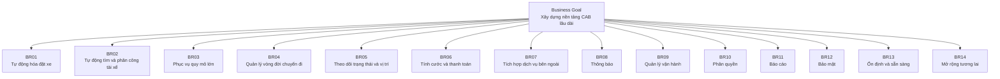

# 3. Phân nhóm Business Requirements

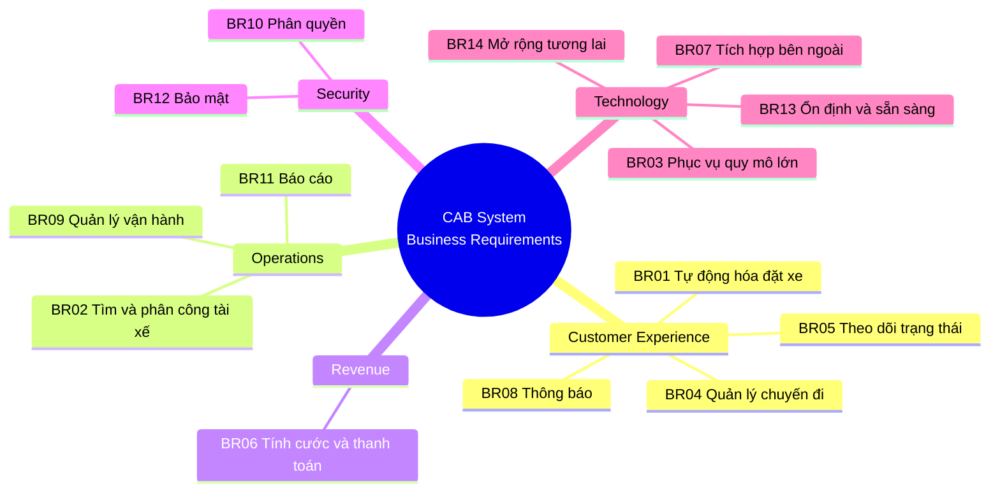

# 4. Bảng Business Requirements tổng hợp

| ID | Business Requirement | Priority |
|---|---|---|
| **BR01** | Tự động hóa quy trình đặt xe | High |
| **BR02** | Tự động tìm và phân công tài xế | **Critical** |
| **BR03** | Phục vụ số lượng lớn khách hàng và tài xế | **Critical** |
| **BR04** | Quản lý toàn bộ vòng đời chuyến đi | **Critical** |
| **BR05** | Theo dõi trạng thái và vị trí chuyến đi | High |
| **BR06** | Tính cước và thanh toán | **Critical** |
| **BR07** | Tích hợp các dịch vụ bên ngoài | High |
| **BR08** | Cung cấp hệ thống thông báo | High |
| **BR09** | Quản lý vận hành tập trung | **Critical** |
| **BR10** | Phân quyền quản trị | High |
| **BR11** | Báo cáo quản trị | Medium |
| **BR12** | Bảo mật dữ liệu | **Critical** |
| **BR13** | Đảm bảo ổn định và sẵn sàng | **Critical** |
| **BR14** | Khả năng mở rộng trong tương lai | High |

# CAB System – Phân rã Functional Requirements

## 1. Tổng quan

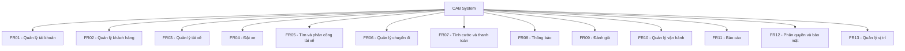

---

# 2. FR01 – Quản lý tài khoản

### FR01.1 – Đăng ký tài khoản

- Khách hàng có thể tạo tài khoản.
- Tài xế có thể đăng ký tài khoản.
- Nhân viên vận hành có thể tạo tài khoản tài xế.

### FR01.2 – Đăng nhập

- Người dùng nhập thông tin xác thực.
- Hệ thống kiểm tra thông tin đăng nhập.
- Hệ thống cho phép truy cập theo quyền.

### FR01.3 – Cập nhật thông tin tài khoản

- Người dùng xem thông tin cá nhân.
- Người dùng cập nhật thông tin cá nhân.
- Hệ thống lưu thông tin mới.

### FR01.4 – Xác thực người dùng

- Xác thực trước khi sử dụng các chức năng yêu cầu tài khoản.
- Từ chối truy cập khi thông tin xác thực không hợp lệ.

---

# 3. FR02 – Quản lý khách hàng

### FR02.1 – Quản lý hồ sơ khách hàng

- Xem thông tin cá nhân.
- Cập nhật thông tin cá nhân.

### FR02.2 – Quản lý lịch sử chuyến đi

- Xem danh sách chuyến đã thực hiện.
- Xem thông tin từng chuyến.
- Xem số tiền phải trả.

---

# 4. FR03 – Quản lý tài xế

### FR03.1 – Quản lý hồ sơ tài xế

- Tạo tài khoản tài xế.
- Cập nhật hồ sơ tài xế.
- Xem thông tin tài xế.

### FR03.2 – Quản lý phương tiện

- Thêm thông tin phương tiện.
- Cập nhật thông tin phương tiện.
- Quản lý phương tiện của tài xế.

### FR03.3 – Quản lý trạng thái tài xế

- Chuyển sang trạng thái sẵn sàng.
- Chuyển sang trạng thái không sẵn sàng.
- Theo dõi trạng thái hoạt động.

---

# 5. FR04 – Đặt xe

### FR04.1 – Nhập thông tin chuyến đi

- Nhập điểm đón.
- Nhập điểm đến.
- Chọn loại xe/dịch vụ.

### FR04.2 – Tạo yêu cầu đặt xe

- Khách hàng gửi yêu cầu.
- Hệ thống tạo chuyến ở trạng thái đang tìm tài xế.

### FR04.3 – Theo dõi yêu cầu đặt xe

Khách hàng có thể biết:

- Hệ thống đang tìm tài xế.
- Tài xế nào đã nhận chuyến.
- Thời gian dự kiến tài xế đến.
- Trạng thái hiện tại của chuyến.

### FR04.4 – Hủy yêu cầu

- Cho phép xử lý việc hủy chuyến theo chính sách doanh nghiệp.
- Chính sách hủy cần được BA xác nhận thêm.

---

# 6. FR05 – Tìm và phân công tài xế

### FR05.1 – Xác định tài xế phù hợp

Hệ thống kiểm tra:

- Vị trí tài xế.
- Trạng thái sẵn sàng.
- Loại xe.
- Các tiêu chí vận hành.

### FR05.2 – Ưu tiên tài xế

- Ưu tiên tài xế phù hợp.
- Ưu tiên tài xế gần khách hàng.

### FR05.3 – Gửi yêu cầu cho tài xế

- Gửi thông báo chuyến mới.
- Cho phép tài xế chấp nhận.
- Cho phép tài xế từ chối.

### FR05.4 – Xử lý tài xế không phản hồi

- Xác định tài xế không phản hồi.
- Chuyển sang tìm tài xế khác.

### FR05.5 – Xử lý tài xế từ chối

- Ghi nhận việc từ chối.
- Tìm tài xế tiếp theo.

### FR05.6 – Không tìm được tài xế

- Xác định không còn tài xế phù hợp.
- Thông báo cho khách hàng.

---

# 7. FR06 – Quản lý chuyến đi

### FR06.1 – Quản lý trạng thái chuyến

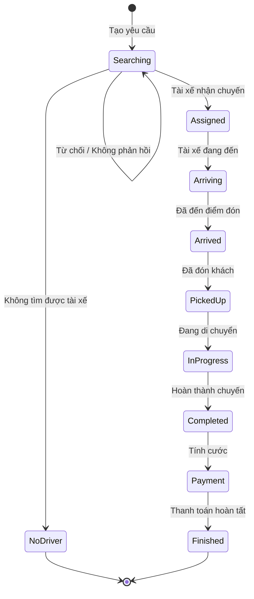

### FR06.2 – Cập nhật trạng thái chuyến

Tài xế có thể cập nhật:

- Đã nhận chuyến.
- Đã đến điểm đón.
- Đã đón khách.
- Đang di chuyển.
- Hoàn thành chuyến.

### FR06.3 – Theo dõi chuyến

- Khách hàng theo dõi chuyến.
- Nhân viên vận hành theo dõi chuyến đang diễn ra.
- Hệ thống lưu lịch sử trạng thái.

---

# 8. FR07 – Tính cước và thanh toán

### FR07.1 – Tính cước

- Xác định loại dịch vụ.
- Sử dụng thông tin chuyến đi.
- Tính số tiền khách hàng phải trả.

### FR07.2 – Thanh toán tiền mặt

- Ghi nhận hình thức thanh toán tiền mặt.
- Lưu trạng thái thanh toán.

### FR07.3 – Thanh toán điện tử

- Gửi yêu cầu đến nhà cung cấp thanh toán.
- Nhận kết quả giao dịch.
- Cập nhật trạng thái thanh toán.

### FR07.4 – Thanh toán thất bại

- Thông báo cho khách hàng.
- Ghi nhận giao dịch thất bại.
- Cho phép xử lý lại theo chính sách doanh nghiệp.

### FR07.5 – Không lưu dữ liệu nhạy cảm

- Không lưu trực tiếp thông tin nhạy cảm của thẻ/tài khoản thanh toán trong CAB System.

---

# 9. FR08 – Quản lý thông báo

### FR08.1 – Thông báo cho khách hàng

Gửi thông báo khi:

- Yêu cầu đặt xe được tiếp nhận.
- Tài xế nhận chuyến.
- Tài xế đến điểm đón.
- Chuyến hoàn thành.
- Thanh toán có kết quả.

### FR08.2 – Thông báo cho tài xế

- Có chuyến mới.
- Có thay đổi liên quan đến chuyến.

### FR08.3 – Quản lý kênh thông báo

- Hỗ trợ kênh thông báo hiện tại.
- Có khả năng bổ sung thêm kênh trong tương lai.

---

# 10. FR09 – Đánh giá tài xế

### FR09.1 – Đánh giá sau chuyến

- Khách hàng có thể đánh giá tài xế sau khi chuyến hoàn thành.
- Hệ thống lưu kết quả đánh giá.

### FR09.2 – Xem thông tin đánh giá

- Doanh nghiệp có thể sử dụng dữ liệu đánh giá để đánh giá hiệu quả tài xế.

---

# 11. FR10 – Quản lý vận hành

### FR10.1 – Quản lý khách hàng

- Xem thông tin khách hàng.
- Tra cứu khách hàng.

### FR10.2 – Quản lý tài xế

- Xem thông tin tài xế.
- Kiểm tra trạng thái tài xế.
- Quản lý tài khoản tài xế.

### FR10.3 – Quản lý phương tiện

- Xem thông tin phương tiện.
- Cập nhật thông tin phương tiện.

### FR10.4 – Theo dõi chuyến đi

- Xem các chuyến đang diễn ra.
- Kiểm tra trạng thái chuyến.
- Kiểm tra trạng thái tài xế.

### FR10.5 – Xử lý sự cố

- Tiếp nhận các trường hợp chuyến bị lỗi.
- Hỗ trợ xử lý chuyến.
- Tra cứu lịch sử giao dịch.

---

# 12. FR11 – Báo cáo

### FR11.1 – Báo cáo chuyến đi

- Tổng số chuyến.
- Số chuyến hoàn thành.
- Số chuyến bị hủy.

### FR11.2 – Báo cáo doanh thu

- Tổng doanh thu.
- Doanh thu theo khoảng thời gian.

### FR11.3 – Báo cáo hiệu quả tài xế

- Số chuyến thực hiện.
- Tỷ lệ hoàn thành.
- Dữ liệu đánh giá/hiệu quả hoạt động.

---

# 13. FR12 – Phân quyền và bảo mật

### FR12.1 – Phân quyền người dùng

Hệ thống phân biệt các nhóm:

- Customer.
- Driver.
- Operations Staff.
- Administrator.

### FR12.2 – Kiểm soát quyền truy cập

- Người dùng chỉ được truy cập chức năng được cấp quyền.
- Các thao tác quản trị nhạy cảm phải được kiểm soát.

### FR12.3 – Audit Log

- Ghi nhận các thao tác quan trọng.
- Lưu thông tin phục vụ kiểm tra khi có sự cố.

---

# 14. FR13 – Quản lý vị trí

### FR13.1 – Cập nhật vị trí tài xế

- Ghi nhận vị trí của tài xế.
- Cập nhật vị trí trong quá trình làm việc.

### FR13.2 – Tìm tài xế gần khách hàng

- Sử dụng vị trí khách hàng.
- Sử dụng vị trí tài xế.
- Xác định tài xế phù hợp và gần khách hàng.

### FR13.3 – Hỗ trợ dự kiến thời gian đến

- Sử dụng dữ liệu vị trí để hỗ trợ ước tính thời gian tài xế đến.

---

# 15. Functional Requirement Tree

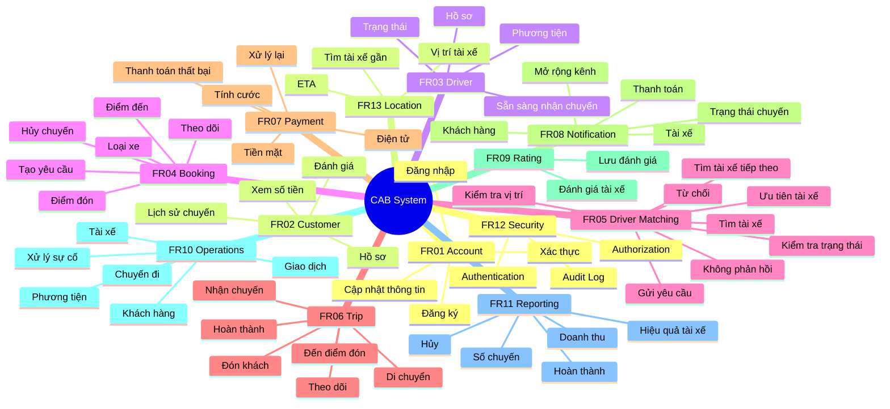

# 16. Các chức năng ưu tiên cho MVP 7 tuần

```mermaid
flowchart TD
    A[MVP CAB System] --> B[Customer]
    A --> C[Driver]
    A --> D[Booking]
    A --> E[Driver Matching]
    A --> F[Trip]
    A --> G[Payment]
    A --> H[Notification]
    A --> I[Operations]

    B --> B1[Đăng ký / Đăng nhập]
    B --> B2[Đặt xe]
    B --> B3[Theo dõi chuyến]

    C --> C1[Đăng nhập]
    C --> C2[Sẵn sàng]
    C --> C3[Nhận / Từ chối]

    D --> D1[Điểm đón]
    D --> D2[Điểm đến]
    D --> D3[Loại xe]

    E --> E1[Tìm tài xế gần]
    E --> E2[Phân công]
    E --> E3[Tìm lại khi từ chối]

    F --> F1[Đến điểm đón]
    F --> F2[Đón khách]
    F --> F3[Di chuyển]
    F --> F4[Hoàn thành]

    G --> G1[Tính cước]
    G --> G2[Tiền mặt]
    G --> G3[Điện tử]

    H --> H1[Thông báo trạng thái]

    I --> I1[Theo dõi chuyến]
    I --> I2[Quản lý tài xế]
```

## 17. Mối quan hệ từ Business Requirement → Functional Requirement

| Business Requirement | Functional Requirements chính |
|---|---|
| **BR01 – Tự động hóa đặt xe** | FR01, FR04 |
| **BR02 – Tìm và phân công tài xế** | FR03, FR05, FR13 |
| **BR03 – Phục vụ quy mô lớn** | Liên quan chủ yếu đến NFR |
| **BR04 – Quản lý vòng đời chuyến** | FR04, FR06 |
| **BR05 – Theo dõi trạng thái/vị trí** | FR06, FR08, FR13 |
| **BR06 – Tính cước/thanh toán** | FR07 |
| **BR07 – Tích hợp bên ngoài** | FR07, FR08, FR13 |
| **BR08 – Thông báo** | FR08 |
| **BR09 – Quản lý vận hành** | FR10 |
| **BR10 – Phân quyền** | FR12 |
| **BR11 – Báo cáo** | FR11 |
| **BR12 – Bảo mật** | FR01, FR12 |
| **BR13 – Ổn định/sẵn sàng** | NFR |
| **BR14 – Mở rộng tương lai** | NFR |

