# 23638831_BuiThiDiemMy_cabsystem
# Dự án xây dựng hệ thống CAB System – Nền tảng đặt xe
## 1. Các bên liên quan

## 1. Các bên liên quan

| Các bên liên quan (Stakeholders) | Vai trò (Role) | Tầm quan trọng |
|---|---|---|
| **Ban giám đốc (Management)** | Đưa ra mục tiêu, định hướng, ngân sách và phê duyệt các yêu cầu chính của hệ thống | **Rất cao** |
| **Khách hàng (Customer)** | Đăng ký, đặt xe, theo dõi chuyến đi, thanh toán, xem lịch sử và đánh giá tài xế | **Rất cao** |
| **Tài xế (Driver)** | Nhận/từ chối chuyến, cập nhật trạng thái chuyến, thông tin phương tiện và vị trí | **Rất cao** |
| **Nhân viên vận hành (Operations Staff)** | Quản lý khách hàng, tài xế, phương tiện, chuyến đi và xử lý sự cố | **Rất cao** |
| **Quản trị viên hệ thống (System Administrator)** | Quản lý tài khoản, phân quyền, cấu hình và bảo mật hệ thống | **Cao** |
| **Business Analyst (BA)** | Thu thập, phân tích, làm rõ và đặc tả yêu cầu | **Cao** |
| **Nhóm phát triển (Development Team)** | Thiết kế, xây dựng, tích hợp và triển khai hệ thống | **Cao** |
| **Nhóm kiểm thử (QA/Tester)** | Kiểm thử chức năng, hiệu năng, bảo mật và độ ổn định | **Cao** |
| **Nhà cung cấp thanh toán (Payment Provider)** | Xử lý các giao dịch thanh toán điện tử | **Cao** |
| **Nhà cung cấp bản đồ/GPS (Map & GPS Provider)** | Cung cấp dữ liệu vị trí, khoảng cách và hỗ trợ tìm tài xế | **Cao** |
| **Nhà cung cấp thông báo (Notification Provider)** | Gửi thông báo đến khách hàng và tài xế | **Trung bình – Cao** |
## 2. Stakeholder Matrix

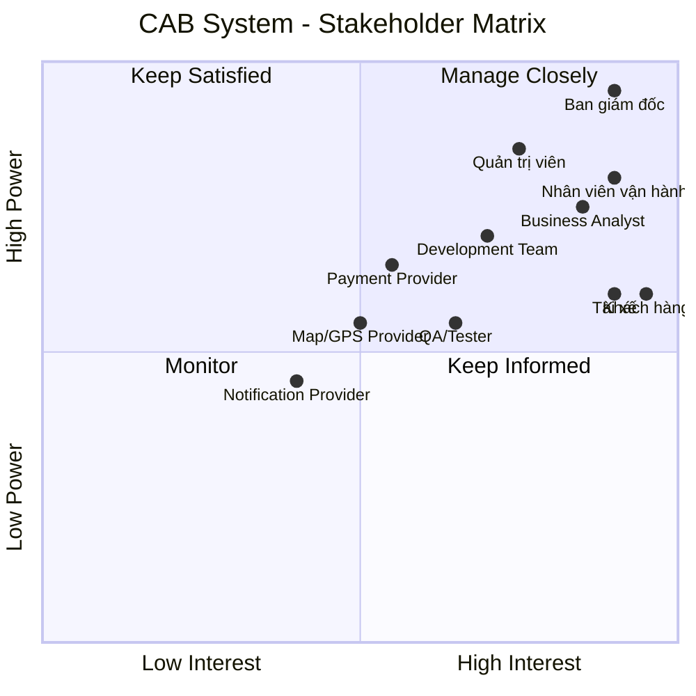

---

---

## 3. Stakeholder quan trọng nhất

| Stakeholder | Mức độ quan trọng | Lý do |
|---|---|---|
| **Management** | ⭐⭐⭐⭐⭐ | Có quyền quyết định và phê duyệt dự án |
| **Customer** | ⭐⭐⭐⭐⭐ | Người sử dụng dịch vụ đặt xe |
| **Driver** | ⭐⭐⭐⭐⭐ | Người trực tiếp thực hiện chuyến xe |
| **Operations Staff** | ⭐⭐⭐⭐⭐ | Quản lý và xử lý hoạt động vận hành |
| **System Administrator** | ⭐⭐⭐⭐ | Quản lý hệ thống, tài khoản và phân quyền |
| **Business Analyst** | ⭐⭐⭐⭐ | Phân tích và làm rõ yêu cầu |
| **Development Team** | ⭐⭐⭐⭐ | Xây dựng hệ thống |
| **QA/Tester** | ⭐⭐⭐⭐ | Đảm bảo chất lượng hệ thống |
| **Payment Provider** | ⭐⭐⭐⭐ | Xử lý thanh toán điện tử |
| **Map/GPS Provider** | ⭐⭐⭐⭐ | Hỗ trợ định vị và tìm tài xế |
| **Notification Provider** | ⭐⭐⭐ | Hỗ trợ gửi thông báo |

# Customer and System Expectations

## 1. Customer Expectations

- **Easy booking:** Khách hàng có thể đăng ký, đăng nhập, nhập điểm đón, điểm đến và chọn loại xe.
- **Trip tracking:** Khách hàng có thể theo dõi trạng thái chuyến đi.
- **Fast driver matching:** Hệ thống tìm tài xế phù hợp và gần khách hàng.
- **Automatic re-matching:** Nếu tài xế từ chối hoặc không phản hồi, hệ thống tiếp tục tìm tài xế khác.
- **Clear notification:** Khách hàng được thông báo khi có tài xế, tài xế đến, chuyến hoàn thành và thanh toán.
- **Flexible payment:** Hỗ trợ thanh toán tiền mặt và thanh toán điện tử.
- **Trip history:** Khách hàng có thể xem lịch sử chuyến đi và số tiền phải trả.
- **Driver rating:** Khách hàng có thể đánh giá tài xế sau chuyến đi.
- **Data security:** Thông tin cá nhân, vị trí và giao dịch được bảo vệ.

## 2. System Expectations

- **Scalability:** Phục vụ số lượng lớn khách hàng và tài xế.
- **Automatic driver matching:** Tự động tìm và ưu tiên tài xế phù hợp.
- **Trip management:** Quản lý toàn bộ trạng thái chuyến đi.
- **Fare and payment management:** Tính cước và hỗ trợ nhiều phương thức thanh toán.
- **Third-party integration:** Có khả năng tích hợp với các nhà cung cấp bên ngoài.
- **Independent scalability:** Các thành phần có thể mở rộng độc lập.
- **High availability:** Lỗi ở một thành phần không làm toàn bộ hệ thống ngừng hoạt động.
- **Security:** Xác thực, phân quyền và bảo vệ dữ liệu.
- **Audit logging:** Lưu vết các thao tác quan trọng.
- **Administration:** Hỗ trợ nhân viên vận hành quản lý hệ thống.
- **Reporting:** Cung cấp báo cáo về chuyến đi, doanh thu, tỷ lệ hoàn thành và hủy chuyến.
- **Future extensibility:** Có thể thêm dịch vụ, phương thức thanh toán và nhà cung cấp mới.


# CAB System – Mục đích nghiệp vụ và yêu cầu hệ thống

## 1. Mục đích của nghiệp vụ

Xây dựng hệ thống **CAB System** nhằm tự động hóa và quản lý toàn bộ quy trình đặt xe, từ khi khách hàng tạo yêu cầu đến khi chuyến đi hoàn thành, thanh toán và đánh giá.

### Mục tiêu cụ thể

- Tự động hóa việc tìm kiếm và phân công tài xế.
- Giảm sự phụ thuộc vào việc phân công tài xế thủ công.
- Giúp khách hàng đặt xe và theo dõi chuyến đi dễ dàng.
- Quản lý tập trung khách hàng, tài xế, phương tiện, chuyến đi và giao dịch.
- Hỗ trợ thanh toán bằng tiền mặt và phương thức điện tử.
- Cung cấp thông báo kịp thời cho khách hàng và tài xế.
- Hỗ trợ nhân viên vận hành quản lý và xử lý sự cố.
- Cung cấp báo cáo về hoạt động kinh doanh.
- Đảm bảo hệ thống bảo mật, ổn định và có khả năng mở rộng.
- Cho phép bổ sung các tính năng mới trong tương lai.

---

# 2. Nghiệp vụ cần làm những gì?

## 2.1. Quản lý khách hàng

- Đăng ký tài khoản.
- Đăng nhập.
- Cập nhật thông tin cá nhân.
- Xem lịch sử chuyến đi.
- Xem số tiền phải trả.
- Đánh giá tài xế sau khi hoàn thành chuyến.

## 2.2. Đặt xe

- Nhập điểm đón.
- Nhập điểm đến.
- Lựa chọn loại xe/dịch vụ.
- Gửi yêu cầu đặt xe.
- Theo dõi trạng thái yêu cầu đặt xe.

## 2.3. Tìm và phân công tài xế

- Xác định các tài xế phù hợp.
- Kiểm tra vị trí của tài xế.
- Kiểm tra trạng thái sẵn sàng của tài xế.
- Áp dụng các tiêu chí vận hành.
- Ưu tiên tài xế phù hợp và gần khách hàng.
- Gửi yêu cầu chuyến đi cho tài xế.
- Nếu tài xế không phản hồi hoặc từ chối, tiếp tục tìm tài xế khác.
- Nếu không tìm được tài xế, thông báo cho khách hàng.

## 2.4. Thực hiện chuyến đi

Tài xế cập nhật trạng thái chuyến:

```text
Đã nhận chuyến
      ↓
Đã đến điểm đón
      ↓
Đã đón khách
      ↓
Đang di chuyển
      ↓
Hoàn thành chuyến


# CAB System – Business Process

## 1. Mục đích nghiệp vụ

Mục đích của CAB System là tự động hóa và quản lý toàn bộ quy trình đặt xe:

- Khách hàng tạo yêu cầu đặt xe.
- Hệ thống tìm và phân công tài xế.
- Tài xế thực hiện chuyến đi.
- Hệ thống tính cước và thanh toán.
- Hệ thống gửi thông báo.
- Khách hàng đánh giá tài xế.
- Doanh nghiệp quản lý và báo cáo hoạt động.

---

## 2. Quy trình nghiệp vụ chính

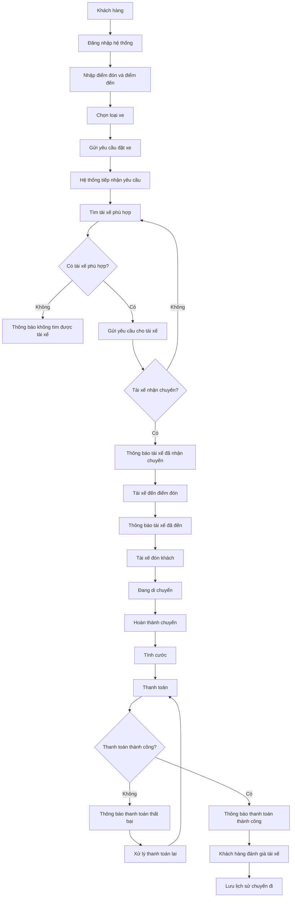

---

# 3. Quy trình tìm và phân công tài xế

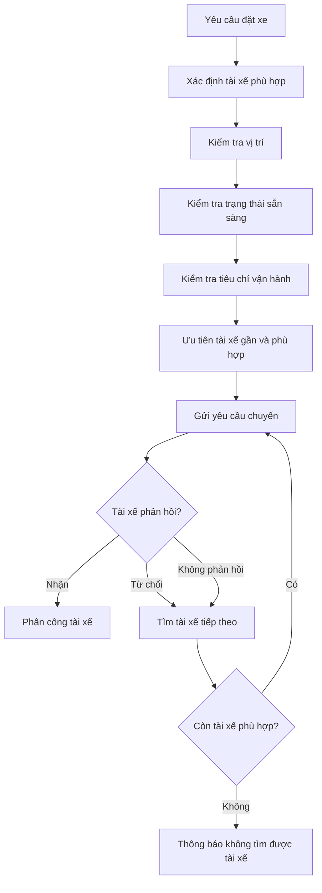

---

# 4. Quy trình thực hiện chuyến đi

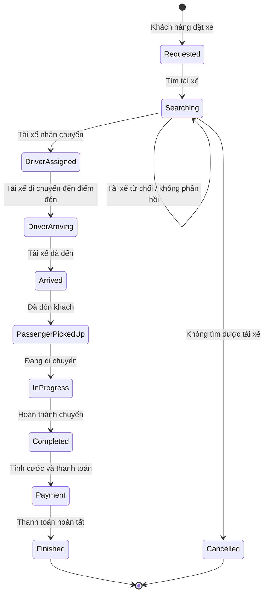

---

# 5. Các nhóm chức năng hệ thống

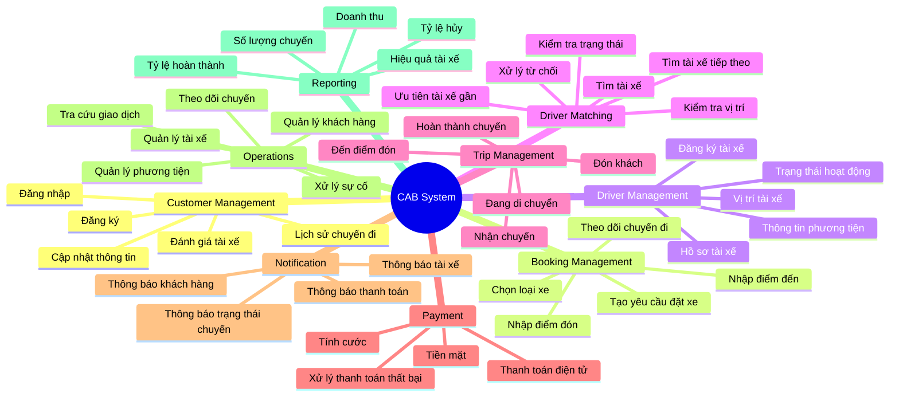

---

# 6. Hệ thống cần đáp ứng

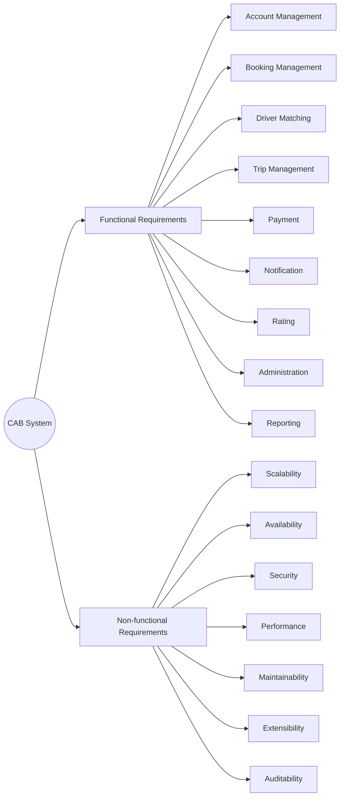

---

# 7. Mối quan hệ giữa nghiệp vụ và hệ thống

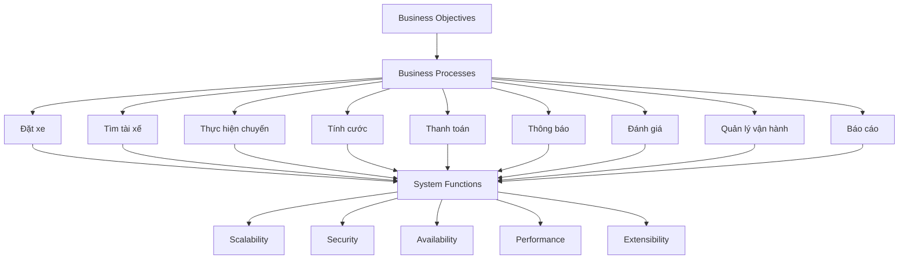

## 8. Tóm tắt

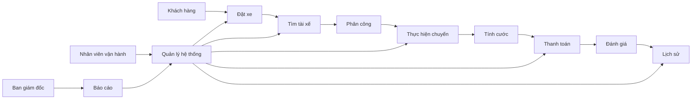
## 2. Phạm vi dự án trong 7 tuần

Do thời gian xây dựng và triển khai chỉ có **7 tuần**, dự án tập trung vào những chức năng **cơ bản, quan trọng và cần thiết nhất** để hệ thống CAB có thể vận hành quy trình chính:

**Đặt xe → Tìm tài xế → Phân công → Thực hiện chuyến → Tính cước → Thanh toán → Hoàn thành**

---

## 2.1. Trong phạm vi (In Scope)

| STT | Phạm vi chính | Chức năng |
|---|---|---|
| 1 | **Quản lý tài khoản** | Đăng ký, đăng nhập và cập nhật thông tin cá nhân |
| 2 | **Đặt xe** | Nhập điểm đón, điểm đến, chọn loại xe và gửi yêu cầu đặt xe |
| 3 | **Tìm tài xế** | Tìm tài xế phù hợp dựa trên vị trí và trạng thái sẵn sàng |
| 4 | **Phân công tài xế** | Gửi yêu cầu cho tài xế, chấp nhận/từ chối và tìm tài xế khác nếu cần |
| 5 | **Quản lý chuyến đi** | Tài xế cập nhật trạng thái: đã đến, đã đón khách, đang di chuyển, hoàn thành |
| 6 | **Theo dõi chuyến đi** | Khách hàng theo dõi trạng thái chuyến, thông tin tài xế và thời gian dự kiến đến |
| 7 | **Tính cước** | Tính số tiền khách hàng phải trả sau khi hoàn thành chuyến |
| 8 | **Thanh toán** | Thanh toán tiền mặt và một phương thức thanh toán điện tử |
| 9 | **Thông báo** | Thông báo cho khách hàng và tài xế về các sự kiện quan trọng |
| 10 | **Đánh giá tài xế** | Khách hàng đánh giá tài xế sau khi hoàn thành chuyến |
| 11 | **Quản lý vận hành** | Quản lý khách hàng, tài xế, phương tiện và chuyến đi |
| 12 | **Xử lý sự cố** | Theo dõi chuyến đang diễn ra và hỗ trợ các trường hợp chuyến bị lỗi |
| 13 | **Phân quyền** | Phân quyền cơ bản cho nhân viên vận hành và quản trị viên |
| 14 | **Báo cáo cơ bản** | Báo cáo số chuyến, doanh thu, tỷ lệ hoàn thành và tỷ lệ hủy |
| 15 | **Bảo mật và lưu vết** | Xác thực người dùng, kiểm soát quyền truy cập và lưu log các thao tác quan trọng |

---

## 2.2. Ngoài phạm vi (Out of Scope)

Do thời gian thực hiện chỉ **7 tuần**, các chức năng không ảnh hưởng trực tiếp đến quy trình đặt xe cốt lõi sẽ chưa được triển khai trong phiên bản đầu tiên.

| STT | Chức năng ngoài phạm vi | Lý do |
|---|---|---|
| 1 | **Khuyến mãi/Voucher** | Không ảnh hưởng đến quy trình đặt xe cơ bản |
| 2 | **Tích điểm thành viên** | Chức năng mở rộng, chưa cần thiết |
| 3 | **Thành viên VIP/Loyalty** | Có thể phát triển ở giai đoạn sau |
| 4 | **Chat giữa khách hàng và tài xế** | Không phải chức năng bắt buộc |
| 5 | **Đặt xe theo lịch** | Chưa cần thiết cho phiên bản đầu tiên |
| 6 | **Nhiều phương thức thanh toán điện tử** | Chỉ cần tích hợp một phương thức trong MVP |
| 7 | **Nhiều nhà cung cấp thông báo** | Chỉ cần một kênh thông báo cơ bản |
| 8 | **AI dự đoán nhu cầu** | Không phải chức năng cốt lõi |
| 9 | **AI tối ưu phân tài xế** | Giai đoạn đầu sử dụng quy tắc phân tài xế cơ bản |
| 10 | **Phân tích dữ liệu nâng cao** | Chưa cần thiết trong giai đoạn đầu |
| 11 | **Hỗ trợ nhiều quốc gia/ngôn ngữ** | Không thuộc phạm vi MVP |
| 12 | **Các loại dịch vụ đặt xe nâng cao** | Có thể phát triển trong tương lai |

---
## 3. Phân chia các Module theo 7 tuần

| Tuần | Module | Nội dung chính |
|---|---|---|
| **Tuần 1** | **Account & User Management** | Đăng ký, đăng nhập, quản lý thông tin khách hàng/tài xế và phân quyền cơ bản |
| **Tuần 2** | **Driver & Vehicle Management** | Quản lý tài xế, phương tiện, trạng thái sẵn sàng và vị trí tài xế |
| **Tuần 3** | **Ride Booking** | Nhập điểm đón, điểm đến, chọn loại xe và tạo yêu cầu đặt xe |
| **Tuần 4** | **Driver Matching & Ride Management** | Tìm tài xế, phân công, nhận/từ chối chuyến và cập nhật trạng thái chuyến |
| **Tuần 5** | **Fare & Payment** | Tính cước, thanh toán tiền mặt, thanh toán điện tử và xử lý thanh toán thất bại |
| **Tuần 6** | **Notification & Operation Management** | Gửi thông báo, theo dõi chuyến, quản lý khách hàng/tài xế/chuyến đi và xử lý sự cố |
| **Tuần 7** | **Reporting, Testing & Deployment** | Báo cáo cơ bản, kiểm thử, sửa lỗi, bảo mật và triển khai hệ thống |


# CAB System – Business Requirements

## 1. Tổng quan

Business Requirements mô tả **doanh nghiệp muốn đạt được điều gì** khi xây dựng CAB System.

Các yêu cầu được xác định từ đề bài gồm:

---

## BR01 – Tự động hóa quy trình đặt xe

**Business Requirement:**

> Hệ thống phải giúp doanh nghiệp tự động hóa quy trình đặt xe, từ khi khách hàng tạo yêu cầu đến khi chuyến đi hoàn thành.

**Mục tiêu kinh doanh:**

- Giảm sự phụ thuộc vào tổng đài.
- Giảm việc phân công tài xế thủ công.
- Tăng tốc độ xử lý yêu cầu đặt xe.
- Nâng cao trải nghiệm khách hàng.

---

## BR02 – Tự động tìm và phân công tài xế

**Business Requirement:**

> Hệ thống phải hỗ trợ doanh nghiệp tự động tìm và phân công tài xế phù hợp dựa trên vị trí, trạng thái sẵn sàng và các tiêu chí vận hành.

**Mục tiêu kinh doanh:**

- Giảm thời gian tìm tài xế.
- Tăng hiệu quả sử dụng tài xế.
- Ưu tiên tài xế phù hợp và gần khách hàng.
- Giảm thao tác thủ công của nhân viên vận hành.

---

## BR03 – Đảm bảo khả năng phục vụ khách hàng và tài xế ở quy mô lớn

**Business Requirement:**

> Hệ thống phải có khả năng phục vụ số lượng lớn khách hàng và tài xế, đặc biệt trong thời điểm nhu cầu tăng cao.

**Mục tiêu kinh doanh:**

- Đáp ứng nhu cầu tăng trưởng.
- Hạn chế tình trạng hệ thống quá tải.
- Hỗ trợ doanh nghiệp mở rộng dịch vụ.

---

## BR04 – Quản lý toàn bộ vòng đời chuyến đi

**Business Requirement:**

> Hệ thống phải hỗ trợ doanh nghiệp quản lý toàn bộ quá trình của một chuyến đi từ lúc tạo yêu cầu, tìm tài xế, nhận chuyến, thực hiện chuyến đến khi hoàn thành.

**Mục tiêu kinh doanh:**

- Theo dõi chính xác trạng thái chuyến.
- Giảm sai sót trong vận hành.
- Cung cấp thông tin minh bạch cho khách hàng và tài xế.

---

## BR05 – Cung cấp thông tin và trạng thái chuyến đi theo thời gian thực

**Business Requirement:**

> Hệ thống phải cung cấp thông tin về trạng thái chuyến đi và vị trí tài xế để khách hàng và bộ phận vận hành có thể theo dõi chuyến.

**Mục tiêu kinh doanh:**

- Nâng cao trải nghiệm khách hàng.
- Giúp khách hàng biết thời gian dự kiến tài xế đến.
- Hỗ trợ nhân viên vận hành giám sát chuyến đi.
- Nâng cao khả năng điều phối.

---

## BR06 – Hỗ trợ tính cước và thanh toán

**Business Requirement:**

> Hệ thống phải hỗ trợ doanh nghiệp quản lý việc tính cước và thanh toán cho các chuyến đi.

**Mục tiêu kinh doanh:**

- Tự động hóa việc tính tiền.
- Hỗ trợ thanh toán tiền mặt và điện tử.
- Quản lý tập trung thông tin giao dịch.
- Giảm sai sót trong quá trình thanh toán.

---

## BR07 – Tích hợp với các dịch vụ bên ngoài

**Business Requirement:**

> Hệ thống phải có khả năng tích hợp với các nhà cung cấp dịch vụ bên ngoài như thanh toán, bản đồ/GPS và thông báo.

**Mục tiêu kinh doanh:**

- Giảm việc xây dựng lại các dịch vụ đã có.
- Tăng khả năng mở rộng.
- Có thể thay đổi hoặc bổ sung nhà cung cấp trong tương lai.

---

## BR08 – Cung cấp hệ thống thông báo

**Business Requirement:**

> Hệ thống phải đảm bảo khách hàng và tài xế nhận được thông tin quan trọng trong quá trình đặt và thực hiện chuyến đi.

**Mục tiêu kinh doanh:**

- Cải thiện khả năng giao tiếp giữa hệ thống, khách hàng và tài xế.
- Giảm tình trạng bỏ lỡ thông tin.
- Tăng tính minh bạch của quá trình vận hành.

---

## BR09 – Hỗ trợ quản lý và vận hành tập trung

**Business Requirement:**

> Hệ thống phải cung cấp khả năng quản lý tập trung khách hàng, tài xế, phương tiện, chuyến đi và giao dịch cho bộ phận vận hành.

**Mục tiêu kinh doanh:**

- Nâng cao hiệu quả quản lý.
- Giảm thao tác thủ công.
- Hỗ trợ xử lý các trường hợp chuyến bị lỗi.
- Có đầy đủ dữ liệu để theo dõi hoạt động.

---

## BR10 – Hỗ trợ phân quyền quản trị

**Business Requirement:**

> Hệ thống phải đảm bảo các chức năng quản trị được kiểm soát theo quyền của từng nhân viên.

**Mục tiêu kinh doanh:**

- Hạn chế truy cập trái phép.
- Bảo vệ các thao tác nhạy cảm.
- Giảm rủi ro do sai sót hoặc lạm dụng quyền.

---

## BR11 – Cung cấp báo cáo quản trị

**Business Requirement:**

> Hệ thống phải cung cấp dữ liệu và báo cáo giúp ban lãnh đạo đánh giá hoạt động kinh doanh và hiệu quả vận hành.

**Mục tiêu kinh doanh:**

- Theo dõi số lượng chuyến.
- Theo dõi doanh thu.
- Theo dõi tỷ lệ hoàn thành.
- Theo dõi tỷ lệ hủy.
- Đánh giá hiệu quả hoạt động của tài xế.
- Hỗ trợ ra quyết định.

---

## BR12 – Đảm bảo bảo mật dữ liệu

**Business Requirement:**

> Hệ thống phải bảo vệ thông tin cá nhân, thông tin phương tiện, dữ liệu vị trí và dữ liệu giao dịch của khách hàng và tài xế.

**Mục tiêu kinh doanh:**

- Bảo vệ dữ liệu người dùng.
- Giảm rủi ro mất hoặc lộ dữ liệu.
- Tăng mức độ tin cậy của dịch vụ.
- Đáp ứng yêu cầu bảo mật của doanh nghiệp.

---

## BR13 – Đảm bảo tính ổn định và sẵn sàng

**Business Requirement:**

> Hệ thống phải duy trì hoạt động ổn định và hạn chế ảnh hưởng dây chuyền khi một thành phần gặp lỗi.

**Mục tiêu kinh doanh:**

- Hạn chế thời gian hệ thống ngừng hoạt động.
- Không để lỗi thanh toán hoặc thông báo làm dừng toàn bộ dịch vụ đặt xe.
- Đảm bảo dịch vụ hoạt động liên tục.

---

## BR14 – Hỗ trợ mở rộng và phát triển trong tương lai

**Business Requirement:**

> Hệ thống phải có khả năng mở rộng để doanh nghiệp có thể bổ sung dịch vụ, phương thức thanh toán, nhà cung cấp thông báo và các thành phần kỹ thuật mới.

**Mục tiêu kinh doanh:**

- Hỗ trợ chiến lược phát triển dài hạn.
- Giảm chi phí khi mở rộng hệ thống.
- Hạn chế việc phải xây dựng lại toàn bộ hệ thống.
- Dễ dàng thích ứng với nhu cầu kinh doanh mới.

---

# 2. Business Requirement Map

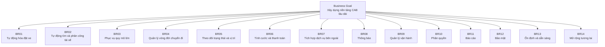

# 3. Phân nhóm Business Requirements

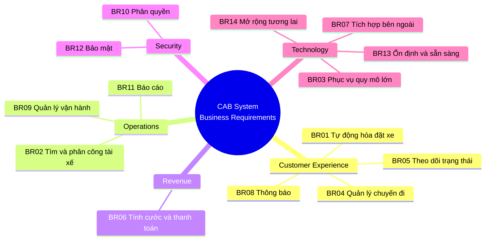

# 4. Bảng Business Requirements tổng hợp

| ID | Business Requirement | Priority |
|---|---|---|
| **BR01** | Tự động hóa quy trình đặt xe | High |
| **BR02** | Tự động tìm và phân công tài xế | **Critical** |
| **BR03** | Phục vụ số lượng lớn khách hàng và tài xế | **Critical** |
| **BR04** | Quản lý toàn bộ vòng đời chuyến đi | **Critical** |
| **BR05** | Theo dõi trạng thái và vị trí chuyến đi | High |
| **BR06** | Tính cước và thanh toán | **Critical** |
| **BR07** | Tích hợp các dịch vụ bên ngoài | High |
| **BR08** | Cung cấp hệ thống thông báo | High |
| **BR09** | Quản lý vận hành tập trung | **Critical** |
| **BR10** | Phân quyền quản trị | High |
| **BR11** | Báo cáo quản trị | Medium |
| **BR12** | Bảo mật dữ liệu | **Critical** |
| **BR13** | Đảm bảo ổn định và sẵn sàng | **Critical** |
| **BR14** | Khả năng mở rộng trong tương lai | High |

# CAB System – Phân rã Functional Requirements

## 1. Tổng quan

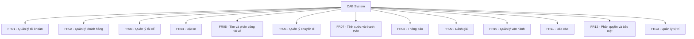

---

# 2. FR01 – Quản lý tài khoản

### FR01.1 – Đăng ký tài khoản

- Khách hàng có thể tạo tài khoản.
- Tài xế có thể đăng ký tài khoản.
- Nhân viên vận hành có thể tạo tài khoản tài xế.

### FR01.2 – Đăng nhập

- Người dùng nhập thông tin xác thực.
- Hệ thống kiểm tra thông tin đăng nhập.
- Hệ thống cho phép truy cập theo quyền.

### FR01.3 – Cập nhật thông tin tài khoản

- Người dùng xem thông tin cá nhân.
- Người dùng cập nhật thông tin cá nhân.
- Hệ thống lưu thông tin mới.

### FR01.4 – Xác thực người dùng

- Xác thực trước khi sử dụng các chức năng yêu cầu tài khoản.
- Từ chối truy cập khi thông tin xác thực không hợp lệ.

---

# 3. FR02 – Quản lý khách hàng

### FR02.1 – Quản lý hồ sơ khách hàng

- Xem thông tin cá nhân.
- Cập nhật thông tin cá nhân.

### FR02.2 – Quản lý lịch sử chuyến đi

- Xem danh sách chuyến đã thực hiện.
- Xem thông tin từng chuyến.
- Xem số tiền phải trả.

---

# 4. FR03 – Quản lý tài xế

### FR03.1 – Quản lý hồ sơ tài xế

- Tạo tài khoản tài xế.
- Cập nhật hồ sơ tài xế.
- Xem thông tin tài xế.

### FR03.2 – Quản lý phương tiện

- Thêm thông tin phương tiện.
- Cập nhật thông tin phương tiện.
- Quản lý phương tiện của tài xế.

### FR03.3 – Quản lý trạng thái tài xế

- Chuyển sang trạng thái sẵn sàng.
- Chuyển sang trạng thái không sẵn sàng.
- Theo dõi trạng thái hoạt động.

---

# 5. FR04 – Đặt xe

### FR04.1 – Nhập thông tin chuyến đi

- Nhập điểm đón.
- Nhập điểm đến.
- Chọn loại xe/dịch vụ.

### FR04.2 – Tạo yêu cầu đặt xe

- Khách hàng gửi yêu cầu.
- Hệ thống tạo chuyến ở trạng thái đang tìm tài xế.

### FR04.3 – Theo dõi yêu cầu đặt xe

Khách hàng có thể biết:

- Hệ thống đang tìm tài xế.
- Tài xế nào đã nhận chuyến.
- Thời gian dự kiến tài xế đến.
- Trạng thái hiện tại của chuyến.

### FR04.4 – Hủy yêu cầu

- Cho phép xử lý việc hủy chuyến theo chính sách doanh nghiệp.
- Chính sách hủy cần được BA xác nhận thêm.

---

# 6. FR05 – Tìm và phân công tài xế

### FR05.1 – Xác định tài xế phù hợp

Hệ thống kiểm tra:

- Vị trí tài xế.
- Trạng thái sẵn sàng.
- Loại xe.
- Các tiêu chí vận hành.

### FR05.2 – Ưu tiên tài xế

- Ưu tiên tài xế phù hợp.
- Ưu tiên tài xế gần khách hàng.

### FR05.3 – Gửi yêu cầu cho tài xế

- Gửi thông báo chuyến mới.
- Cho phép tài xế chấp nhận.
- Cho phép tài xế từ chối.

### FR05.4 – Xử lý tài xế không phản hồi

- Xác định tài xế không phản hồi.
- Chuyển sang tìm tài xế khác.

### FR05.5 – Xử lý tài xế từ chối

- Ghi nhận việc từ chối.
- Tìm tài xế tiếp theo.

### FR05.6 – Không tìm được tài xế

- Xác định không còn tài xế phù hợp.
- Thông báo cho khách hàng.

---

# 7. FR06 – Quản lý chuyến đi

### FR06.1 – Quản lý trạng thái chuyến

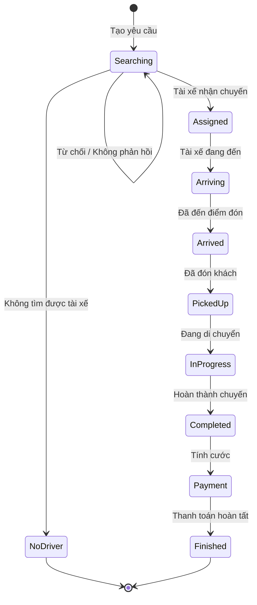

### FR06.2 – Cập nhật trạng thái chuyến

Tài xế có thể cập nhật:

- Đã nhận chuyến.
- Đã đến điểm đón.
- Đã đón khách.
- Đang di chuyển.
- Hoàn thành chuyến.

### FR06.3 – Theo dõi chuyến

- Khách hàng theo dõi chuyến.
- Nhân viên vận hành theo dõi chuyến đang diễn ra.
- Hệ thống lưu lịch sử trạng thái.

---

# 8. FR07 – Tính cước và thanh toán

### FR07.1 – Tính cước

- Xác định loại dịch vụ.
- Sử dụng thông tin chuyến đi.
- Tính số tiền khách hàng phải trả.

### FR07.2 – Thanh toán tiền mặt

- Ghi nhận hình thức thanh toán tiền mặt.
- Lưu trạng thái thanh toán.

### FR07.3 – Thanh toán điện tử

- Gửi yêu cầu đến nhà cung cấp thanh toán.
- Nhận kết quả giao dịch.
- Cập nhật trạng thái thanh toán.

### FR07.4 – Thanh toán thất bại

- Thông báo cho khách hàng.
- Ghi nhận giao dịch thất bại.
- Cho phép xử lý lại theo chính sách doanh nghiệp.

### FR07.5 – Không lưu dữ liệu nhạy cảm

- Không lưu trực tiếp thông tin nhạy cảm của thẻ/tài khoản thanh toán trong CAB System.

---

# 9. FR08 – Quản lý thông báo

### FR08.1 – Thông báo cho khách hàng

Gửi thông báo khi:

- Yêu cầu đặt xe được tiếp nhận.
- Tài xế nhận chuyến.
- Tài xế đến điểm đón.
- Chuyến hoàn thành.
- Thanh toán có kết quả.

### FR08.2 – Thông báo cho tài xế

- Có chuyến mới.
- Có thay đổi liên quan đến chuyến.

### FR08.3 – Quản lý kênh thông báo

- Hỗ trợ kênh thông báo hiện tại.
- Có khả năng bổ sung thêm kênh trong tương lai.

---

# 10. FR09 – Đánh giá tài xế

### FR09.1 – Đánh giá sau chuyến

- Khách hàng có thể đánh giá tài xế sau khi chuyến hoàn thành.
- Hệ thống lưu kết quả đánh giá.

### FR09.2 – Xem thông tin đánh giá

- Doanh nghiệp có thể sử dụng dữ liệu đánh giá để đánh giá hiệu quả tài xế.

---

# 11. FR10 – Quản lý vận hành

### FR10.1 – Quản lý khách hàng

- Xem thông tin khách hàng.
- Tra cứu khách hàng.

### FR10.2 – Quản lý tài xế

- Xem thông tin tài xế.
- Kiểm tra trạng thái tài xế.
- Quản lý tài khoản tài xế.

### FR10.3 – Quản lý phương tiện

- Xem thông tin phương tiện.
- Cập nhật thông tin phương tiện.

### FR10.4 – Theo dõi chuyến đi

- Xem các chuyến đang diễn ra.
- Kiểm tra trạng thái chuyến.
- Kiểm tra trạng thái tài xế.

### FR10.5 – Xử lý sự cố

- Tiếp nhận các trường hợp chuyến bị lỗi.
- Hỗ trợ xử lý chuyến.
- Tra cứu lịch sử giao dịch.

---

# 12. FR11 – Báo cáo

### FR11.1 – Báo cáo chuyến đi

- Tổng số chuyến.
- Số chuyến hoàn thành.
- Số chuyến bị hủy.

### FR11.2 – Báo cáo doanh thu

- Tổng doanh thu.
- Doanh thu theo khoảng thời gian.

### FR11.3 – Báo cáo hiệu quả tài xế

- Số chuyến thực hiện.
- Tỷ lệ hoàn thành.
- Dữ liệu đánh giá/hiệu quả hoạt động.

---

# 13. FR12 – Phân quyền và bảo mật

### FR12.1 – Phân quyền người dùng

Hệ thống phân biệt các nhóm:

- Customer.
- Driver.
- Operations Staff.
- Administrator.

### FR12.2 – Kiểm soát quyền truy cập

- Người dùng chỉ được truy cập chức năng được cấp quyền.
- Các thao tác quản trị nhạy cảm phải được kiểm soát.

### FR12.3 – Audit Log

- Ghi nhận các thao tác quan trọng.
- Lưu thông tin phục vụ kiểm tra khi có sự cố.

---

# 14. FR13 – Quản lý vị trí

### FR13.1 – Cập nhật vị trí tài xế

- Ghi nhận vị trí của tài xế.
- Cập nhật vị trí trong quá trình làm việc.

### FR13.2 – Tìm tài xế gần khách hàng

- Sử dụng vị trí khách hàng.
- Sử dụng vị trí tài xế.
- Xác định tài xế phù hợp và gần khách hàng.

### FR13.3 – Hỗ trợ dự kiến thời gian đến

- Sử dụng dữ liệu vị trí để hỗ trợ ước tính thời gian tài xế đến.

---

# 15. Functional Requirement Tree

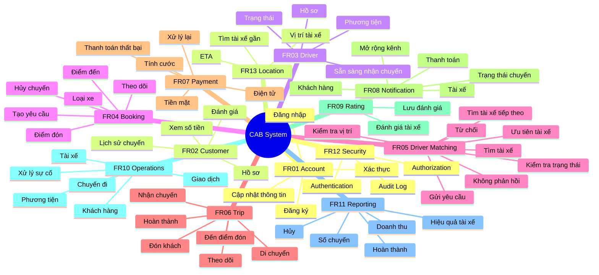

# 16. Các chức năng ưu tiên cho MVP 7 tuần

```mermaid
flowchart TD
    A[MVP CAB System] --> B[Customer]
    A --> C[Driver]
    A --> D[Booking]
    A --> E[Driver Matching]
    A --> F[Trip]
    A --> G[Payment]
    A --> H[Notification]
    A --> I[Operations]

    B --> B1[Đăng ký / Đăng nhập]
    B --> B2[Đặt xe]
    B --> B3[Theo dõi chuyến]

    C --> C1[Đăng nhập]
    C --> C2[Sẵn sàng]
    C --> C3[Nhận / Từ chối]

    D --> D1[Điểm đón]
    D --> D2[Điểm đến]
    D --> D3[Loại xe]

    E --> E1[Tìm tài xế gần]
    E --> E2[Phân công]
    E --> E3[Tìm lại khi từ chối]

    F --> F1[Đến điểm đón]
    F --> F2[Đón khách]
    F --> F3[Di chuyển]
    F --> F4[Hoàn thành]

    G --> G1[Tính cước]
    G --> G2[Tiền mặt]
    G --> G3[Điện tử]

    H --> H1[Thông báo trạng thái]

    I --> I1[Theo dõi chuyến]
    I --> I2[Quản lý tài xế]
```

## 17. Mối quan hệ từ Business Requirement → Functional Requirement

| Business Requirement | Functional Requirements chính |
|---|---|
| **BR01 – Tự động hóa đặt xe** | FR01, FR04 |
| **BR02 – Tìm và phân công tài xế** | FR03, FR05, FR13 |
| **BR03 – Phục vụ quy mô lớn** | Liên quan chủ yếu đến NFR |
| **BR04 – Quản lý vòng đời chuyến** | FR04, FR06 |
| **BR05 – Theo dõi trạng thái/vị trí** | FR06, FR08, FR13 |
| **BR06 – Tính cước/thanh toán** | FR07 |
| **BR07 – Tích hợp bên ngoài** | FR07, FR08, FR13 |
| **BR08 – Thông báo** | FR08 |
| **BR09 – Quản lý vận hành** | FR10 |
| **BR10 – Phân quyền** | FR12 |
| **BR11 – Báo cáo** | FR11 |
| **BR12 – Bảo mật** | FR01, FR12 |
| **BR13 – Ổn định/sẵn sàng** | NFR |
| **BR14 – Mở rộng tương lai** | NFR |

# CAB System – Use Case Diagram

## 1. Actors

Hệ thống có các actor chính:

- **Customer** – Khách hàng
- **Driver** – Tài xế
- **Operations Staff** – Nhân viên vận hành
- **Administrator** – Quản trị viên
- **Payment Provider** – Nhà cung cấp thanh toán
- **Notification Provider** – Nhà cung cấp thông báo

---

# 2. Use Case Diagram – Tổng quan

```mermaid
flowchart LR

    Customer[👤 Customer<br/>Khách hàng]
    Driver[🚗 Driver<br/>Tài xế]
    Operator[👨‍💼 Operations Staff<br/>Nhân viên vận hành]
    Admin[🔐 Administrator<br/>Quản trị viên]
    Payment[💳 Payment Provider<br/>Nhà cung cấp thanh toán]
    Notification[🔔 Notification Provider<br/>Nhà cung cấp thông báo]

    subgraph CAB["CAB SYSTEM"]
        UC01((Đăng ký tài khoản))
        UC02((Đăng nhập))
        UC03((Cập nhật thông tin))

        UC04((Đặt xe))
        UC05((Theo dõi chuyến đi))
        UC06((Xem lịch sử chuyến))
        UC07((Đánh giá tài xế))

        UC08((Quản lý hồ sơ tài xế))
        UC09((Quản lý phương tiện))
        UC10((Cập nhật trạng thái sẵn sàng))
        UC11((Nhận / Từ chối chuyến))
        UC12((Cập nhật trạng thái chuyến))
        UC13((Cập nhật vị trí))

        UC14((Tìm tài xế phù hợp))
        UC15((Phân công tài xế))

        UC16((Tính cước))
        UC17((Thanh toán))
        UC18((Xử lý thanh toán thất bại))

        UC19((Gửi thông báo))

        UC20((Quản lý khách hàng))
        UC21((Quản lý tài xế))
        UC22((Quản lý phương tiện))
        UC23((Theo dõi chuyến đang diễn ra))
        UC24((Xử lý chuyến bị lỗi))
        UC25((Tra cứu giao dịch))

        UC26((Quản lý tài khoản và phân quyền))
        UC27((Xem báo cáo))
        UC28((Lưu Audit Log))
    end

    Customer --- UC01
    Customer --- UC02
    Customer --- UC03
    Customer --- UC04
    Customer --- UC05
    Customer --- UC06
    Customer --- UC07

    Driver --- UC01
    Driver --- UC02
    Driver --- UC03
    Driver --- UC08
    Driver --- UC09
    Driver --- UC10
    Driver --- UC11
    Driver --- UC12
    Driver --- UC13

    Operator --- UC20
    Operator --- UC21
    Operator --- UC22
    Operator --- UC23
    Operator --- UC24
    Operator --- UC25
    Operator --- UC27

    Admin --- UC26
    Admin --- UC28

    Payment --- UC17
    Notification --- UC19
```

---

# 3. Use Case chính – Đặt xe

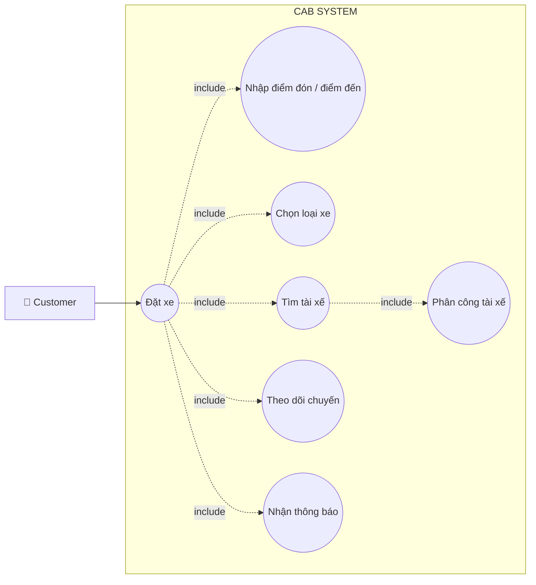

---

# 4. Use Case – Tìm và phân công tài xế

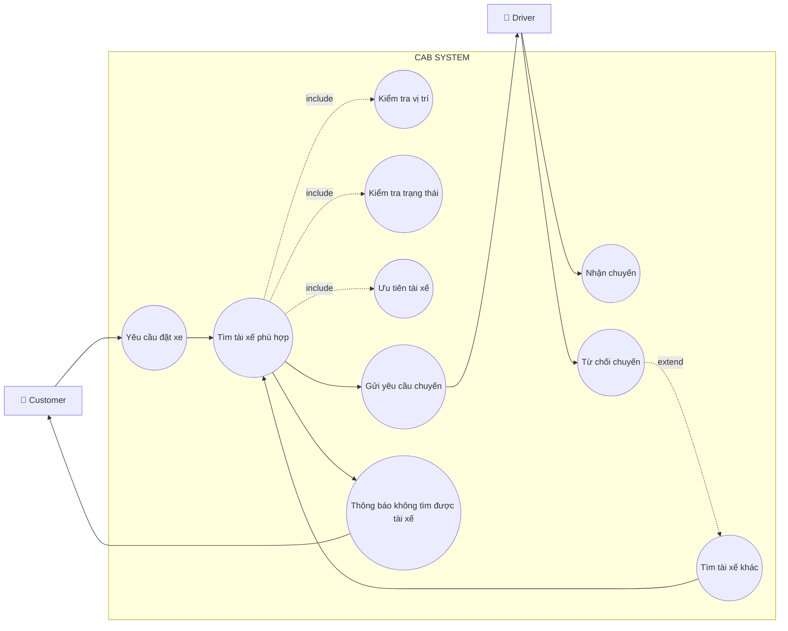

---

# 5. Use Case – Thực hiện chuyến đi

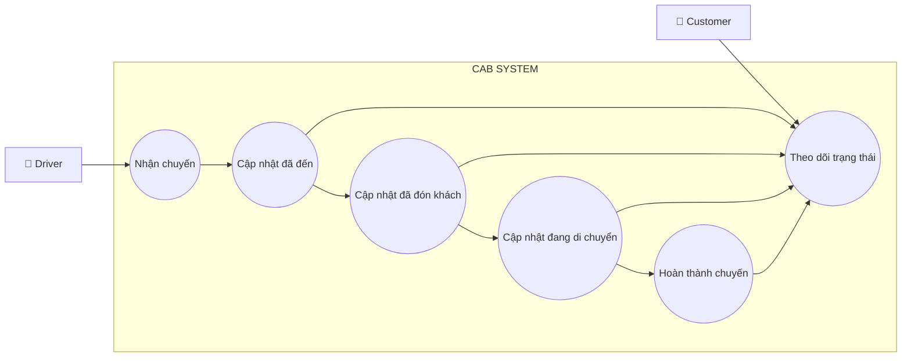

---

# 6. Use Case – Thanh toán

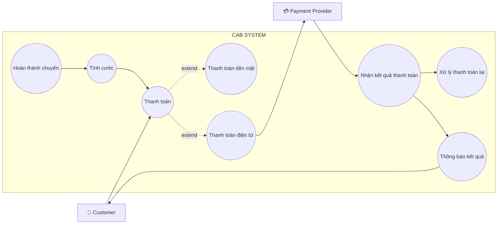

---

# 7. Use Case – Quản lý vận hành

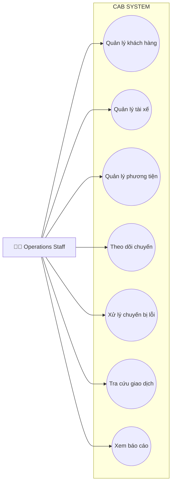

---

# 8. Use Case – Quản trị hệ thống

```mermaid
flowchart LR

    Admin[🔐 Administrator]

    subgraph CAB["CAB SYSTEM"]
        Account((Quản lý tài khoản))
        Role((Phân quyền))
        Access((Kiểm soát quyền truy cập))
        Audit((Lưu Audit Log))
    end

    Admin --> Account
    Admin --> Role
    Admin --> Access
    Admin --> Audit
```

---

# 9. Các quan hệ Use Case quan trọng

## <<include>>

Dùng khi một Use Case **luôn luôn cần** một Use Case khác.

Ví dụ:

```text
Đặt xe
  <<include>>
Nhập điểm đón / điểm đến
```

```text
Tìm tài xế
  <<include>>
Kiểm tra vị trí
```

```text
Tìm tài xế
  <<include>>
Kiểm tra trạng thái
```

## <<extend>>

Dùng khi một hành vi **chỉ xảy ra trong một trường hợp cụ thể**.

Ví dụ:

```text
Tìm tài xế
      ↑
   <<extend>>
      |
Tìm tài xế khác
```

```text
Thanh toán
      ↑
   <<extend>>
      |
Xử lý thanh toán thất bại
```

---

# 10. Use Case Diagram MVP – 7 tuần

Nếu phạm vi dự án chỉ làm **MVP trong 7 tuần**, nên tập trung vào các Use Case sau:

```mermaid
flowchart TB

    Customer[👤 Customer]
    Driver[🚗 Driver]
    Operator[👨‍💼 Operations Staff]
    Payment[💳 Payment Provider]
    Notification[🔔 Notification Provider]

    subgraph MVP["CAB SYSTEM - MVP"]
        A((Đăng ký / Đăng nhập))
        B((Đặt xe))
        C((Tìm tài xế))
        D((Nhận / Từ chối chuyến))
        E((Theo dõi chuyến))
        F((Cập nhật trạng thái chuyến))
        G((Tính cước))
        H((Thanh toán))
        I((Thông báo))
        J((Quản lý vận hành))
    end

    Customer --> A
    Customer --> B
    Customer --> E

    Driver --> A
    Driver --> C
    Driver --> D
    Driver --> F

    Operator --> J

    B --> C
    C --> D
    D --> F
    F --> G
    G --> H
    H --> I
    I --> Customer
    I --> Driver

    Payment --> H
    Notification --> I
```

# 11. Các Use Case nên ưu tiên trong MVP

| Priority | Use Case | Lý do |
|---|---|---|
| 🔴 **P0** | Đăng ký / Đăng nhập | Nền tảng cho người dùng |
| 🔴 **P0** | Đặt xe | Chức năng kinh doanh cốt lõi |
| 🔴 **P0** | Tìm tài xế | Chức năng cốt lõi của CAB |
| 🔴 **P0** | Nhận / Từ chối chuyến | Cần để phân công tài xế |
| 🔴 **P0** | Quản lý trạng thái chuyến | Cần để hoàn thành chuyến |
| 🔴 **P0** | Tính cước | Cần xác định số tiền |
| 🔴 **P0** | Thanh toán | Hoàn thành quy trình kinh doanh |
| 🔴 **P0** | Thông báo | Đảm bảo khách hàng/tài xế biết trạng thái |
| 🟠 **P1** | Quản lý vận hành | Cần cho doanh nghiệp vận hành |
| 🟠 **P1** | Theo dõi vị trí | Hỗ trợ tìm tài xế gần |
| 🟡 **P2** | Lịch sử chuyến | Có thể hoàn thiện sau chức năng lõi |
| 🟡 **P2** | Đánh giá tài xế | Không ảnh hưởng đến việc hoàn thành chuyến |
| 🟡 **P2** | Báo cáo nâng cao | Có thể phát triển sau MVP |


# CAB System – Đặc tả Use Case và Phân tích quy trình nghiệp vụ

# I. ĐẶC TẢ USE CASE

## UC01 – Đăng ký tài khoản

| Thuộc tính | Nội dung |
|---|---|
| **Use Case ID** | UC01 |
| **Tên Use Case** | Đăng ký tài khoản |
| **Actor chính** | Customer / Driver |
| **Mục tiêu** | Tạo tài khoản để sử dụng hệ thống |
| **Điều kiện trước** | Người dùng chưa có tài khoản |
| **Điều kiện sau** | Tài khoản được tạo thành công |
| **Trigger** | Người dùng chọn chức năng đăng ký |

### Main Flow

1. Người dùng chọn **Đăng ký**.
2. Hệ thống hiển thị biểu mẫu đăng ký.
3. Người dùng nhập thông tin cần thiết.
4. Hệ thống kiểm tra thông tin.
5. Hệ thống kiểm tra tài khoản đã tồn tại hay chưa.
6. Hệ thống tạo tài khoản.
7. Hệ thống thông báo đăng ký thành công.

### Alternative Flow

- **A1:** Thông tin không hợp lệ → Hệ thống yêu cầu nhập lại.
- **A2:** Tài khoản đã tồn tại → Hệ thống thông báo và yêu cầu sử dụng thông tin khác.

---

# UC02 – Đăng nhập

| Thuộc tính | Nội dung |
|---|---|
| **Use Case ID** | UC02 |
| **Tên Use Case** | Đăng nhập |
| **Actor chính** | Customer / Driver / Operations Staff |
| **Mục tiêu** | Xác thực người dùng |
| **Điều kiện trước** | Người dùng đã có tài khoản |
| **Điều kiện sau** | Người dùng đăng nhập thành công |
| **Trigger** | Người dùng chọn Đăng nhập |

### Main Flow

1. Người dùng nhập thông tin đăng nhập.
2. Hệ thống kiểm tra thông tin.
3. Hệ thống xác thực tài khoản.
4. Hệ thống xác định quyền của người dùng.
5. Hệ thống cho phép truy cập chức năng tương ứng.

### Alternative Flow

- **A1:** Sai thông tin đăng nhập → Thông báo lỗi.
- **A2:** Tài khoản không hoạt động → Từ chối đăng nhập.

---

# UC03 – Đặt xe

| Thuộc tính | Nội dung |
|---|---|
| **Use Case ID** | UC03 |
| **Tên Use Case** | Đặt xe |
| **Actor chính** | Customer |
| **Mục tiêu** | Tạo yêu cầu chuyến đi |
| **Điều kiện trước** | Customer đã đăng nhập |
| **Điều kiện sau** | Yêu cầu đặt xe được tạo |
| **Trigger** | Customer muốn sử dụng dịch vụ |

### Main Flow

1. Customer chọn **Đặt xe**.
2. Hệ thống yêu cầu nhập điểm đón.
3. Customer nhập điểm đón.
4. Customer nhập điểm đến.
5. Customer chọn loại xe.
6. Hệ thống kiểm tra thông tin chuyến.
7. Customer xác nhận đặt xe.
8. Hệ thống tạo yêu cầu đặt xe.
9. Hệ thống chuyển yêu cầu sang trạng thái **Đang tìm tài xế**.
10. Hệ thống bắt đầu tìm tài xế phù hợp.
11. Hệ thống thông báo yêu cầu đã được tiếp nhận.

### Alternative Flow

- **A1:** Thiếu điểm đón/điểm đến → Yêu cầu nhập đầy đủ.
- **A2:** Không có tài xế phù hợp → Thông báo cho Customer.
- **A3:** Customer hủy yêu cầu → Hệ thống xử lý theo chính sách hủy.

---

# UC04 – Tìm và phân công tài xế

| Thuộc tính | Nội dung |
|---|---|
| **Use Case ID** | UC04 |
| **Tên Use Case** | Tìm và phân công tài xế |
| **Actor chính** | System |
| **Actor phụ** | Driver |
| **Mục tiêu** | Tìm được tài xế phù hợp cho chuyến |
| **Điều kiện trước** | Có yêu cầu đặt xe |
| **Điều kiện sau** | Một tài xế được phân công hoặc hệ thống thông báo không tìm được tài xế |
| **Trigger** | Customer tạo yêu cầu đặt xe |

### Main Flow

1. Hệ thống nhận yêu cầu đặt xe.
2. Hệ thống xác định các tài xế phù hợp.
3. Hệ thống kiểm tra trạng thái sẵn sàng của tài xế.
4. Hệ thống kiểm tra vị trí tài xế.
5. Hệ thống áp dụng tiêu chí ưu tiên.
6. Hệ thống chọn tài xế phù hợp.
7. Hệ thống gửi yêu cầu chuyến cho tài xế.
8. Tài xế nhận chuyến.
9. Hệ thống phân công tài xế.
10. Hệ thống thông báo cho Customer.
11. Chuyến chuyển sang trạng thái **Đã phân công**.

### Alternative Flow

- **A1:** Tài xế từ chối → Hệ thống tìm tài xế tiếp theo.
- **A2:** Tài xế không phản hồi → Hệ thống tìm tài xế tiếp theo.
- **A3:** Không còn tài xế phù hợp → Hệ thống thông báo Customer.

---

# UC05 – Thực hiện chuyến đi

| Thuộc tính | Nội dung |
|---|---|
| **Use Case ID** | UC05 |
| **Tên Use Case** | Thực hiện chuyến đi |
| **Actor chính** | Driver |
| **Actor phụ** | Customer |
| **Mục tiêu** | Hoàn thành chuyến đi |
| **Điều kiện trước** | Driver đã nhận chuyến |
| **Điều kiện sau** | Chuyến đi hoàn thành |
| **Trigger** | Driver nhận chuyến |

### Main Flow

1. Driver nhận chuyến.
2. Driver di chuyển đến điểm đón.
3. Driver cập nhật **Đã đến điểm đón**.
4. Hệ thống cập nhật trạng thái chuyến.
5. Customer nhận thông báo.
6. Driver đón Customer.
7. Driver cập nhật **Đã đón khách**.
8. Driver bắt đầu di chuyển.
9. Driver cập nhật **Đang di chuyển**.
10. Customer theo dõi trạng thái chuyến.
11. Driver đến điểm đến.
12. Driver cập nhật **Hoàn thành chuyến**.
13. Hệ thống chuyển chuyến sang trạng thái hoàn thành.

### Alternative Flow

- **A1:** Chuyến gặp sự cố → Nhân viên vận hành hỗ trợ xử lý.
- **A2:** Customer/Driver yêu cầu hủy → Xử lý theo chính sách hủy.

---

# UC06 – Tính cước

| Thuộc tính | Nội dung |
|---|---|
| **Use Case ID** | UC06 |
| **Tên Use Case** | Tính cước |
| **Actor chính** | System |
| **Mục tiêu** | Xác định số tiền Customer phải trả |
| **Điều kiện trước** | Chuyến đã hoàn thành |
| **Điều kiện sau** | Số tiền phải trả được xác định |
| **Trigger** | Chuyến chuyển sang trạng thái hoàn thành |

### Main Flow

1. Hệ thống nhận thông tin chuyến hoàn thành.
2. Hệ thống xác định loại dịch vụ.
3. Hệ thống lấy thông tin chuyến đi.
4. Hệ thống áp dụng quy tắc tính cước.
5. Hệ thống xác định số tiền phải trả.
6. Hệ thống lưu thông tin cước.
7. Hệ thống hiển thị số tiền cho Customer.

### Business Rule

> Cách tính cước cụ thể chưa được doanh nghiệp chốt và cần BA xác nhận trước khi phát triển.

---

# UC07 – Thanh toán

| Thuộc tính | Nội dung |
|---|---|
| **Use Case ID** | UC07 |
| **Tên Use Case** | Thanh toán |
| **Actor chính** | Customer |
| **Actor phụ** | Payment Provider |
| **Mục tiêu** | Hoàn tất thanh toán chuyến đi |
| **Điều kiện trước** | Chuyến hoàn thành và đã có số tiền phải trả |
| **Điều kiện sau** | Giao dịch được ghi nhận thành công hoặc thất bại |
| **Trigger** | Customer thực hiện thanh toán |

### Main Flow

1. Hệ thống hiển thị số tiền phải trả.
2. Customer lựa chọn phương thức thanh toán.
3. Nếu tiền mặt, hệ thống ghi nhận thanh toán tiền mặt.
4. Nếu thanh toán điện tử, hệ thống gửi yêu cầu đến Payment Provider.
5. Payment Provider xử lý giao dịch.
6. Payment Provider trả kết quả.
7. Hệ thống cập nhật trạng thái thanh toán.
8. Hệ thống thông báo kết quả cho Customer.

### Alternative Flow

- **A1:** Thanh toán điện tử thất bại → Hệ thống thông báo lỗi.
- **A2:** Customer thực hiện lại thanh toán → Hệ thống gửi lại yêu cầu.
- **A3:** Payment Provider không phản hồi → Hệ thống ghi nhận trạng thái phù hợp và xử lý theo chính sách doanh nghiệp.

---

# UC08 – Theo dõi chuyến đi

| Thuộc tính | Nội dung |
|---|---|
| **Use Case ID** | UC08 |
| **Tên Use Case** | Theo dõi chuyến đi |
| **Actor chính** | Customer |
| **Actor phụ** | Operations Staff |
| **Mục tiêu** | Theo dõi trạng thái chuyến và tài xế |
| **Điều kiện trước** | Customer có chuyến đang hoạt động |
| **Điều kiện sau** | Thông tin trạng thái được hiển thị |

### Main Flow

1. Customer mở chuyến đang thực hiện.
2. Hệ thống hiển thị trạng thái chuyến.
3. Hệ thống hiển thị thông tin tài xế.
4. Hệ thống hiển thị thời gian dự kiến tài xế đến.
5. Hệ thống cập nhật trạng thái khi có thay đổi.

---

# UC09 – Quản lý vận hành

| Thuộc tính | Nội dung |
|---|---|
| **Use Case ID** | UC09 |
| **Tên Use Case** | Quản lý vận hành |
| **Actor chính** | Operations Staff |
| **Mục tiêu** | Giám sát và hỗ trợ hoạt động đặt xe |
| **Điều kiện trước** | Nhân viên đã đăng nhập và có quyền |
| **Điều kiện sau** | Dữ liệu được tra cứu hoặc vấn đề được xử lý |

### Main Flow

1. Nhân viên đăng nhập.
2. Hệ thống kiểm tra quyền.
3. Nhân viên xem các chuyến đang diễn ra.
4. Nhân viên kiểm tra trạng thái tài xế.
5. Nhân viên tra cứu khách hàng/tài xế/phương tiện.
6. Nhân viên kiểm tra giao dịch.
7. Khi có sự cố, nhân viên thực hiện xử lý.
8. Hệ thống lưu lại thao tác quan trọng.

---

# II. PHÂN TÍCH QUY TRÌNH NGHIỆP VỤ

## 1. Quy trình nghiệp vụ hiện tại – AS-IS

Theo đề bài, hệ thống hiện tại còn phụ thuộc nhiều vào tổng đài và phân công tài xế thủ công.

```mermaid
flowchart TD
    A[Khách hàng cần đặt xe]
    B[Liên hệ tổng đài / ứng dụng đơn giản]
    C[Nhân viên tiếp nhận yêu cầu]
    D[Nhân viên tìm tài xế]
    E[Phân công tài xế thủ công]
    F[Tài xế thực hiện chuyến]
    G[Khách hàng thanh toán]
    H[Thông tin giao dịch được xử lý]
    
    A --> B
    B --> C
    C --> D
    D --> E
    E --> F
    F --> G
    G --> H
```

### Vấn đề của AS-IS

| Vấn đề | Ảnh hưởng |
|---|---|
| Phân công tài xế thủ công | Tốn thời gian |
| Khó theo dõi trạng thái chuyến | Khách hàng thiếu thông tin |
| Thanh toán chưa tập trung | Khó quản lý giao dịch |
| Khó mở rộng | Không đáp ứng tốt khi số lượng người dùng tăng |
| Phụ thuộc vào nhân viên vận hành | Tăng chi phí vận hành |
| Khó xử lý khi tài xế từ chối | Làm chậm quá trình đặt xe |

---

# 2. Quy trình nghiệp vụ đề xuất – TO-BE

```mermaid
flowchart TD

    A[Customer]
    B[Tạo yêu cầu đặt xe]
    C[Hệ thống tiếp nhận]
    D[Tìm tài xế phù hợp]
    E{Có tài xế?}
    F[Gửi yêu cầu cho Driver]
    G{Driver nhận?}
    H[Phân công tài xế]
    I[Driver đến điểm đón]
    J[Đón khách]
    K[Đang di chuyển]
    L[Hoàn thành chuyến]
    M[Tính cước]
    N[Thanh toán]
    O[Thông báo kết quả]
    P[Đánh giá]
    Q[Lưu lịch sử]

    A --> B
    B --> C
    C --> D
    D --> E

    E -- Không --> R[Thông báo không tìm được tài xế]
    E -- Có --> F

    F --> G
    G -- Không --> D
    G -- Có --> H

    H --> I
    I --> J
    J --> K
    K --> L

    L --> M
    M --> N
    N --> O
    O --> P
    P --> Q
```

---

# 3. So sánh AS-IS và TO-BE

| AS-IS | TO-BE |
|---|---|
| Khách hàng gọi tổng đài | Khách hàng đặt xe trực tuyến |
| Nhân viên tìm tài xế thủ công | Hệ thống tự động tìm tài xế |
| Khó biết trạng thái chuyến | Theo dõi trạng thái chuyến |
| Phân công thủ công | Tự động phân công |
| Khó xử lý khi tài xế từ chối | Tự động tìm tài xế tiếp theo |
| Thanh toán chưa tập trung | Quản lý thanh toán tập trung |
| Thông báo hạn chế | Thông báo tự động |
| Khó mở rộng | Kiến trúc có khả năng mở rộng |
| Quản lý dữ liệu phân tán | Quản lý tập trung |
| Báo cáo hạn chế | Báo cáo hoạt động |

---

# 4. Business Process chính của CAB System

```mermaid
flowchart LR

    A[Đặt xe]
    B[Tìm tài xế]
    C[Phân công]
    D[Thực hiện chuyến]
    E[Tính cước]
    F[Thanh toán]
    G[Thông báo]
    H[Đánh giá]
    I[Lưu lịch sử]

    A --> B
    B --> C
    C --> D
    D --> E
    E --> F
    F --> G
    G --> H
    H --> I
```

---

# 5. Các điểm quyết định quan trọng trong quy trình

```mermaid
flowchart TD

    A[Tạo yêu cầu] --> B{Có tài xế phù hợp?}

    B -- Có --> C[Gửi yêu cầu]
    B -- Không --> D[Thông báo khách hàng]

    C --> E{Tài xế nhận?}

    E -- Có --> F[Thực hiện chuyến]
    E -- Không --> G[Tìm tài xế khác]

    G --> B

    F --> H[Hoàn thành chuyến]
    H --> I{Thanh toán thành công?}

    I -- Có --> J[Hoàn tất]
    I -- Không --> K[Thông báo thất bại]
    K --> L[Xử lý lại]
    L --> I
```

---

# 6. Các vấn đề nghiệp vụ cần BA làm rõ

Đề bài đã chỉ rõ một số Business Rules **chưa được chốt**.

| STT | Vấn đề cần xác nhận |
|---|---|
| 1 | Cách tính cước cụ thể |
| 2 | Tiêu chí ưu tiên tài xế |
| 3 | Khoảng cách tối đa để tìm tài xế |
| 4 | Thời gian tài xế phải phản hồi |
| 5 | Số lần thử tìm tài xế |
| 6 | Chính sách hủy chuyến |
| 7 | Phí hủy chuyến |
| 8 | Cách xử lý khi mất kết nối mạng |
| 9 | Cách xử lý giao dịch thanh toán không rõ trạng thái |
| 10 | Thời gian lưu trữ dữ liệu |
| 11 | Quyền hạn cụ thể của từng loại nhân viên |
| 12 | Kênh thông báo được sử dụng trong MVP |
