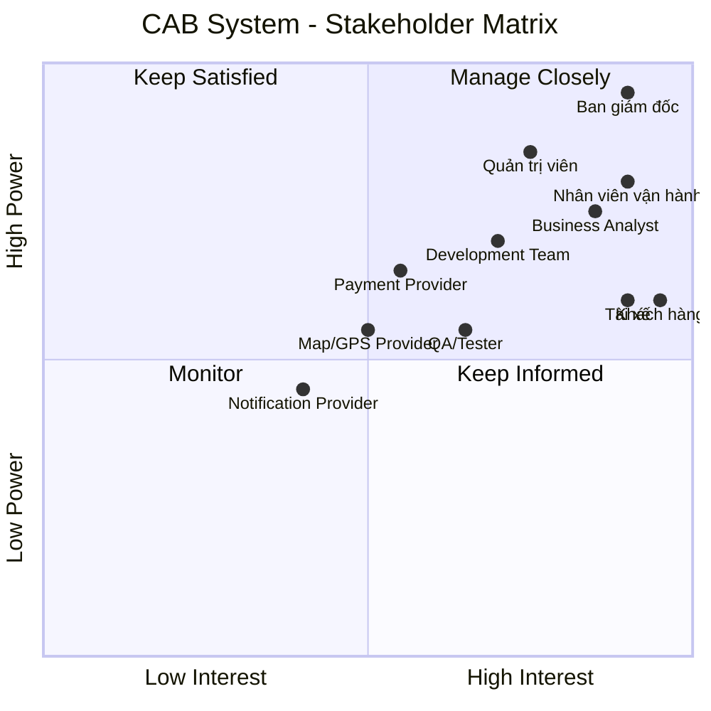

# 23638831_BuiThiDiemMy_cabsystem
# Dự án xây dựng hệ thống CAB System – Nền tảng đặt xe
## 1. Các bên liên quan

## 1. Các bên liên quan

| Các bên liên quan (Stakeholders) | Vai trò (Role) ||
|---|---|---
| **Ban giám đốc (Management)** | Đưa ra mục tiêu, định hướng, ngân sách và phê duyệt các yêu cầu chính của hệ thống | **Rất cao** |
| **Khách hàng (Customer)** | Đăng ký, đặt xe, theo dõi chuyến đi, thanh toán, xem lịch sử và đánh giá tài xế | **Rất cao** |
| **Tài xế (Driver)** | Nhận/từ chối chuyến, cập nhật trạng thái chuyến, thông tin phương tiện và vị trí | **Rất cao** |
| **Nhân viên vận hành (Operations Staff)** | Quản lý khách hàng, tài xế, phương tiện, chuyến đi và xử lý sự cố | **Rất cao** |
| **Quản trị viên hệ thống (System Administrator)** | Quản lý tài khoản, phân quyền, cấu hình và bảo mật hệ thống | **Cao** |
---
## 2. Stakeholder Matrix

---
## 3. Phân loại Stakeholders

### Manage Closely – Quản lý chặt chẽ

- Ban giám đốc
- Nhân viên vận hành
- Quản trị viên hệ thống
- Business Analyst

**Lý do:** Đây là nhóm có ảnh hưởng lớn đến dự án và có mức độ quan tâm cao. Cần trao đổi thường xuyên để xác định phạm vi, yêu cầu, quy tắc nghiệp vụ và các vấn đề chưa rõ.

### Keep Satisfied – Duy trì sự hài lòng

- Nhà cung cấp thanh toán
- Nhà cung cấp bản đồ/GPS
- Development Team

**Lý do:** Nhóm này có ảnh hưởng đáng kể đến khả năng vận hành và tích hợp của hệ thống. Cần đảm bảo họ nhận được đầy đủ thông tin và yêu cầu kỹ thuật.

### Keep Informed – Cập nhật thường xuyên

- Khách hàng
- Tài xế
- QA/Tester

**Lý do:** Khách hàng và tài xế là người sử dụng trực tiếp hệ thống, trong khi QA/Tester chịu trách nhiệm kiểm tra chất lượng. Cần thu thập phản hồi và cập nhật thay đổi thường xuyên.

### Monitor – Theo dõi

- Nhà cung cấp dịch vụ thông báo

**Lý do:** Nhà cung cấp thông báo có ảnh hưởng đến một phần hệ thống nhưng không tham gia trực tiếp vào toàn bộ hoạt động của CAB System.

---

## 4. Stakeholder quan trọng nhất

| Stakeholder | Mức độ quan trọng | Lý do |
|---|---|---|
| **Management** | ⭐⭐⭐⭐⭐ | Có quyền quyết định và phê duyệt dự án |
| **Customer** | ⭐⭐⭐⭐⭐ | Người sử dụng dịch vụ đặt xe |
| **Driver** | ⭐⭐⭐⭐⭐ | Người trực tiếp thực hiện chuyến xe |
| **Operations Staff** | ⭐⭐⭐⭐⭐ | Quản lý và xử lý hoạt động vận hành |
| **System Administrator** | ⭐⭐⭐⭐ | Quản lý hệ thống, tài khoản và phân quyền |
| **Business Analyst** | ⭐⭐⭐⭐ | Phân tích và làm rõ yêu cầu |
| **Development Team** | ⭐⭐⭐⭐ | Xây dựng hệ thống |
| **QA/Tester** | ⭐⭐⭐⭐ | Đảm bảo chất lượng hệ thống |
| **Payment Provider** | ⭐⭐⭐⭐ | Xử lý thanh toán điện tử |
| **Map/GPS Provider** | ⭐⭐⭐⭐ | Hỗ trợ định vị và tìm tài xế |
| **Notification Provider** | ⭐⭐⭐ | Hỗ trợ gửi thông báo |
