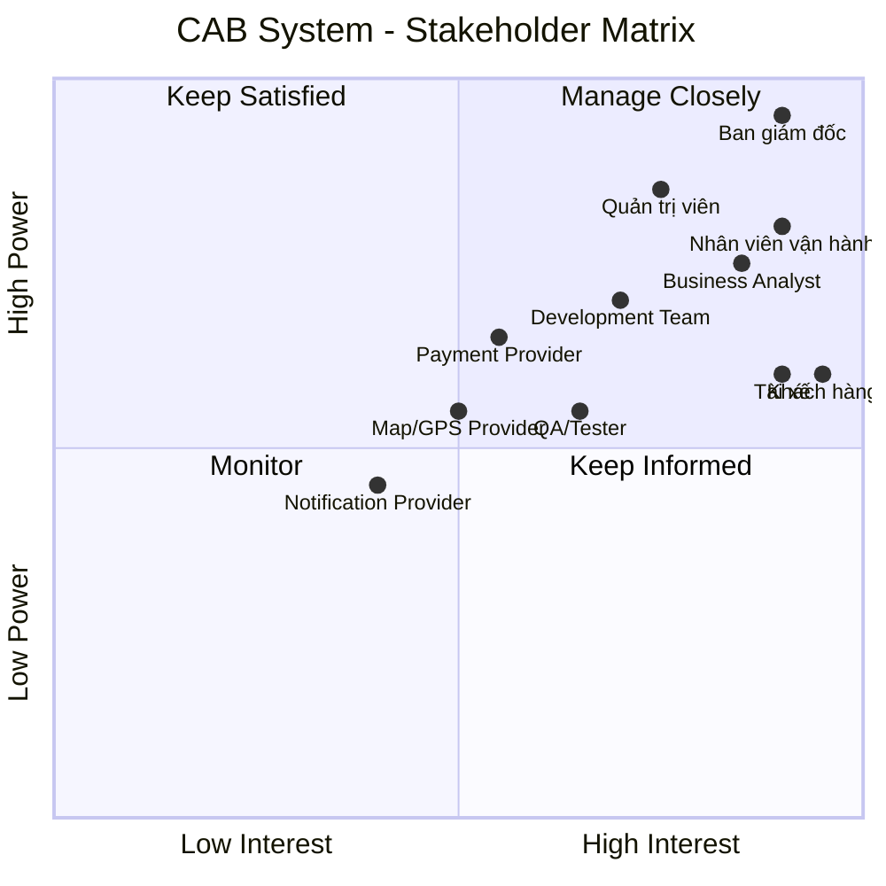

# 23638831_BuiThiDiemMy_cabsystem
# Dự án xây dựng hệ thống CAB System – Nền tảng đặt xe
## 1. Các bên liên quan

## 1. Các bên liên quan

| Các bên liên quan (Stakeholders) | Vai trò (Role) ||
|---|---|---
| **Ban giám đốc (Management)** | Đưa ra mục tiêu, định hướng, ngân sách và phê duyệt các yêu cầu chính của hệ thống | **Rất cao** |
| **Khách hàng (Customer)** | Đăng ký, đặt xe, theo dõi chuyến đi, thanh toán, xem lịch sử và đánh giá tài xế | **Rất cao** |
| **Tài xế (Driver)** | Nhận/từ chối chuyến, cập nhật trạng thái chuyến, thông tin phương tiện và vị trí | **Rất cao** |
| **Nhân viên vận hành (Operations Staff)** | Quản lý khách hàng, tài xế, phương tiện, chuyến đi và xử lý sự cố | **Rất cao** |
| **Quản trị viên hệ thống (System Administrator)** | Quản lý tài khoản, phân quyền, cấu hình và bảo mật hệ thống | **Cao** |
---
## 2. Stakeholder Matrix

---
