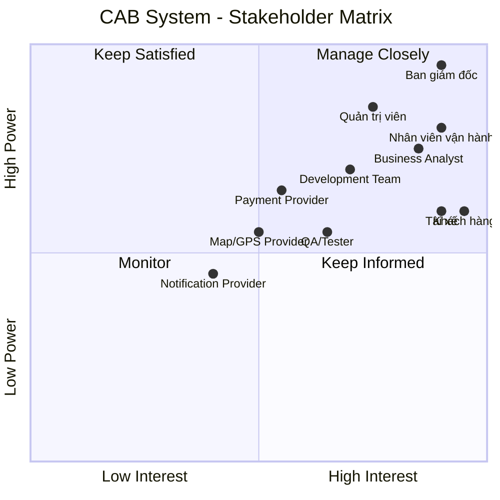

# 23638831_BuiThiDiemMy_cabsystem
# Dự án xây dựng hệ thống CAB System – Nền tảng đặt xe
## 1. Các bên liên quan

## 1. Các bên liên quan

| Các bên liên quan (Stakeholders) | Vai trò (Role) ||
|---|---|---
| **Ban giám đốc (Management)** | Đưa ra mục tiêu, định hướng, ngân sách và phê duyệt các yêu cầu chính của hệ thống | **Rất cao** |
| **Khách hàng (Customer)** | Đăng ký, đặt xe, theo dõi chuyến đi, thanh toán, xem lịch sử và đánh giá tài xế | **Rất cao** |
| **Tài xế (Driver)** | Nhận/từ chối chuyến, cập nhật trạng thái chuyến, thông tin phương tiện và vị trí | **Rất cao** |
| **Nhân viên vận hành (Operations Staff)** | Quản lý khách hàng, tài xế, phương tiện, chuyến đi và xử lý sự cố | **Rất cao** |
| **Quản trị viên hệ thống (System Administrator)** | Quản lý tài khoản, phân quyền, cấu hình và bảo mật hệ thống | **Cao** |
---
## 2. Stakeholder Matrix

---

---

## 3. Stakeholder quan trọng nhất

| Stakeholder | Mức độ quan trọng | Lý do |
|---|---|---|
| **Management** | ⭐⭐⭐⭐⭐ | Có quyền quyết định và phê duyệt dự án |
| **Customer** | ⭐⭐⭐⭐⭐ | Người sử dụng dịch vụ đặt xe |
| **Driver** | ⭐⭐⭐⭐⭐ | Người trực tiếp thực hiện chuyến xe |
| **Operations Staff** | ⭐⭐⭐⭐⭐ | Quản lý và xử lý hoạt động vận hành |
| **System Administrator** | ⭐⭐⭐⭐ | Quản lý hệ thống, tài khoản và phân quyền |
| **Business Analyst** | ⭐⭐⭐⭐ | Phân tích và làm rõ yêu cầu |
| **Development Team** | ⭐⭐⭐⭐ | Xây dựng hệ thống |
| **QA/Tester** | ⭐⭐⭐⭐ | Đảm bảo chất lượng hệ thống |
| **Payment Provider** | ⭐⭐⭐⭐ | Xử lý thanh toán điện tử |
| **Map/GPS Provider** | ⭐⭐⭐⭐ | Hỗ trợ định vị và tìm tài xế |
| **Notification Provider** | ⭐⭐⭐ | Hỗ trợ gửi thông báo |

# Customer and System Expectations

## 1. Customer Expectations

- **Easy booking:** Khách hàng có thể đăng ký, đăng nhập, nhập điểm đón, điểm đến và chọn loại xe.
- **Trip tracking:** Khách hàng có thể theo dõi trạng thái chuyến đi.
- **Fast driver matching:** Hệ thống tìm tài xế phù hợp và gần khách hàng.
- **Automatic re-matching:** Nếu tài xế từ chối hoặc không phản hồi, hệ thống tiếp tục tìm tài xế khác.
- **Clear notification:** Khách hàng được thông báo khi có tài xế, tài xế đến, chuyến hoàn thành và thanh toán.
- **Flexible payment:** Hỗ trợ thanh toán tiền mặt và thanh toán điện tử.
- **Trip history:** Khách hàng có thể xem lịch sử chuyến đi và số tiền phải trả.
- **Driver rating:** Khách hàng có thể đánh giá tài xế sau chuyến đi.
- **Data security:** Thông tin cá nhân, vị trí và giao dịch được bảo vệ.

## 2. System Expectations

- **Scalability:** Phục vụ số lượng lớn khách hàng và tài xế.
- **Automatic driver matching:** Tự động tìm và ưu tiên tài xế phù hợp.
- **Trip management:** Quản lý toàn bộ trạng thái chuyến đi.
- **Fare and payment management:** Tính cước và hỗ trợ nhiều phương thức thanh toán.
- **Third-party integration:** Có khả năng tích hợp với các nhà cung cấp bên ngoài.
- **Independent scalability:** Các thành phần có thể mở rộng độc lập.
- **High availability:** Lỗi ở một thành phần không làm toàn bộ hệ thống ngừng hoạt động.
- **Security:** Xác thực, phân quyền và bảo vệ dữ liệu.
- **Audit logging:** Lưu vết các thao tác quan trọng.
- **Administration:** Hỗ trợ nhân viên vận hành quản lý hệ thống.
- **Reporting:** Cung cấp báo cáo về chuyến đi, doanh thu, tỷ lệ hoàn thành và hủy chuyến.
- **Future extensibility:** Có thể thêm dịch vụ, phương thức thanh toán và nhà cung cấp mới.
