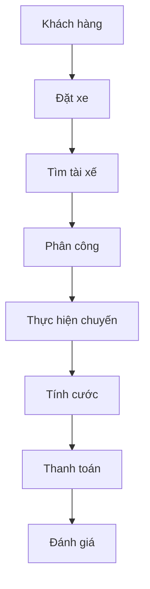
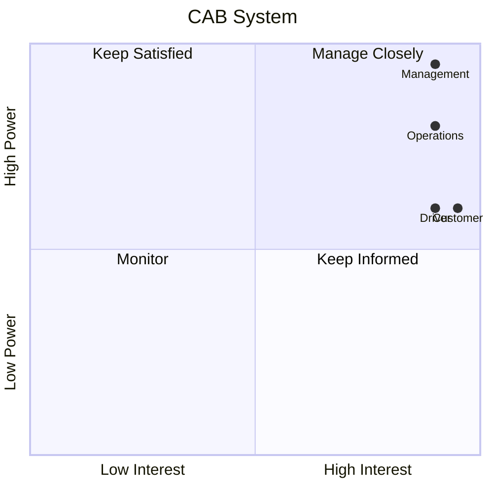
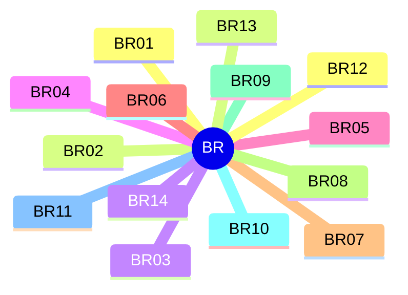
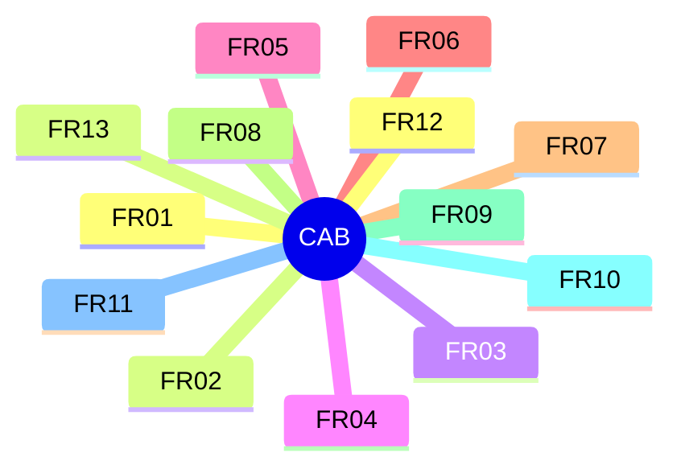
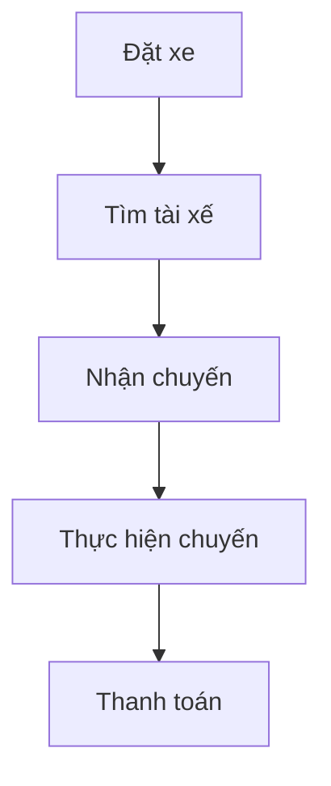
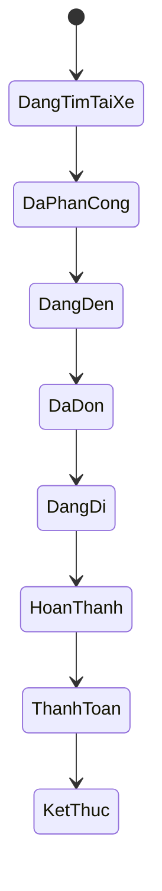
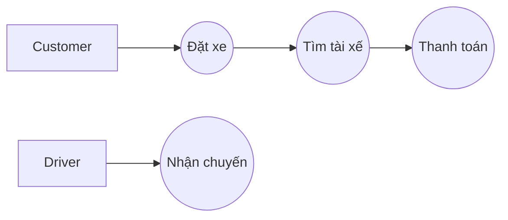

<div align="center">

# 🚖 CAB System

### Hệ thống đặt xe trực tuyến

**Đồ án Business Analysis – Đại học Công nghiệp TP.HCM**


</div>

---

## Tổng quan

CAB System là hệ thống đặt xe trực tuyến giúp tự động hóa toàn bộ quy trình từ khi khách hàng tạo yêu cầu đặt xe đến khi chuyến đi hoàn thành, thanh toán và đánh giá tài xế.

### Mục tiêu

- Tự động tìm và phân công tài xế.
- Theo dõi chuyến đi theo thời gian thực.
- Hỗ trợ thanh toán tiền mặt và điện tử.
- Quản lý tập trung khách hàng, tài xế và chuyến đi.
- Dễ dàng mở rộng trong tương lai.

---

## Cấu trúc tài liệu

| Nội dung | Đường dẫn |
|----------|-----------|
| Phân tích Stakeholder | `docs/requirements/stakeholder_analysis.md` |
| Mong đợi của khách hàng và hệ thống | `docs/requirements/customer_system_expectations.md` |
| Yêu cầu nghiệp vụ | `docs/requirements/business_requirements.md` |
| Yêu cầu chức năng | `docs/requirements/functional_requirements.md` |
| Business Rules | `docs/requirements/business_rules.md` |
| Quy trình nghiệp vụ | `docs/design/business_process.md` |
| AS-IS & TO-BE | `docs/design/as_is_to_be.md` |
| Use Case Diagram | `docs/design/usecase_diagram.md` |
| Đặc tả Use Case | `docs/design/usecase_specification.md` |
| Ma trận truy vết | `docs/design/traceability_matrix.md` |
| Test Scenario | `docs/testing/test_scenario.md` |
| Test Case | `docs/testing/test_case.md` |

---

## Quy trình nghiệp vụ tổng quan



---

## Phạm vi MVP (7 tuần)

| Tuần | Module |
|------|--------|
| 1 | Quản lý tài khoản |
| 2 | Quản lý tài xế |
| 3 | Đặt xe |
| 4 | Phân công tài xế |
| 5 | Thanh toán |
| 6 | Quản lý vận hành |
| 7 | Kiểm thử và triển khai |

---

## Cấu trúc thư mục

```text
23638831_BuiThiDiemMy_cabsystem/
│
├── README.md
└── docs/
    ├── requirements/
    ├── design/
    └── testing/
```

---
# Phân tích Stakeholder

## Danh sách Stakeholder

| Stakeholder | Vai trò |
|-------------|----------|
| Ban giám đốc | Định hướng dự án |
| Khách hàng | Đặt xe |
| Tài xế | Thực hiện chuyến |
| Nhân viên vận hành | Quản lý hệ thống |
| Quản trị viên | Phân quyền |
| BA | Phân tích yêu cầu |
| Nhóm phát triển | Xây dựng hệ thống |
| QA | Kiểm thử |
| Nhà cung cấp GPS | Định vị |
| Nhà cung cấp thanh toán | Thanh toán |

## Stakeholder Matrix


# Mong đợi của khách hàng và hệ thống

## Mong đợi của khách hàng

- Đặt xe dễ dàng.
- Theo dõi chuyến đi.
- Tìm tài xế nhanh.
- Thanh toán linh hoạt.
- Xem lịch sử chuyến đi.
- Đánh giá tài xế.

## Mong đợi của hệ thống

- Khả năng mở rộng.
- Hoạt động ổn định.
- Bảo mật.
- Lưu vết thao tác.
- Hỗ trợ báo cáo.
# Yêu cầu nghiệp vụ (BR)

## Danh sách BR

| Mã | Nội dung |
|----|----------|
| BR01 | Tự động hóa quy trình đặt xe |
| BR02 | Tự động tìm tài xế |
| BR03 | Phục vụ số lượng lớn |
| BR04 | Quản lý vòng đời chuyến |
| BR05 | Theo dõi chuyến |
| BR06 | Thanh toán |
| BR07 | Tích hợp dịch vụ |
| BR08 | Thông báo |
| BR09 | Quản lý vận hành |
| BR10 | Phân quyền |
| BR11 | Báo cáo |
| BR12 | Bảo mật |
| BR13 | Hoạt động ổn định |
| BR14 | Khả năng mở rộng |

## Sơ đồ BR


# Yêu cầu chức năng (FR)

| Mã | Chức năng |
|----|-----------|
| FR01 | Quản lý tài khoản |
| FR02 | Quản lý khách hàng |
| FR03 | Quản lý tài xế |
| FR04 | Đặt xe |
| FR05 | Tìm tài xế |
| FR06 | Quản lý chuyến |
| FR07 | Thanh toán |
| FR08 | Thông báo |
| FR09 | Đánh giá |
| FR10 | Quản lý vận hành |
| FR11 | Báo cáo |
| FR12 | Phân quyền |
| FR13 | Quản lý vị trí |

## Cây chức năng


# Business Rules

| Mã | Quy tắc |
|----|---------|
| RULE-01 | Phải xác thực người dùng |
| RULE-02 | Phân quyền |
| RULE-03 | Chỉ tài xế sẵn sàng mới nhận chuyến |
| RULE-04 | Ưu tiên tài xế gần |
| RULE-05 | Tự động tìm tài xế khác |
| RULE-06 | Thông báo khi không có tài xế |
| RULE-07 | Cập nhật trạng thái chuyến |
| RULE-08 | Tính cước sau khi hoàn thành |
| RULE-09 | Không lưu thông tin nhạy cảm của thẻ |
| RULE-10 | Lưu Audit Log |
# Quy trình nghiệp vụ

## Quy trình tổng quát



## Trạng thái chuyến


# AS-IS và TO-BE

## AS-IS

- Tìm tài xế thủ công.
- Khó theo dõi.
- Phụ thuộc tổng đài.

## TO-BE

- Tự động tìm tài xế.
- Theo dõi thời gian thực.
- Thanh toán tập trung.
# Use Case Diagram


# Đặc tả Use Case

## UC01 – Đăng ký

- Actor: Khách hàng
- Điều kiện trước: Chưa có tài khoản
- Kết quả: Tạo tài khoản thành công

## UC02 – Đăng nhập

- Actor: Khách hàng/Tài xế
- Kết quả: Truy cập hệ thống

## UC03 – Đặt xe

- Actor: Khách hàng
- Kết quả: Tạo yêu cầu đặt xe
# Ma trận truy vết

| BR | FR | UC | TC |
|----|----|----|----|
| BR01 | FR04 | UC03 | TC_BOOK_001 |
| BR02 | FR05 | UC04 | TC_MATCH_001 |
| BR06 | FR07 | UC07 | TC_PAY_001 |

## Sinh viên thực hiện

- **Bùi Thị Diễm My**
- Đại học Công nghiệp TP.HCM
