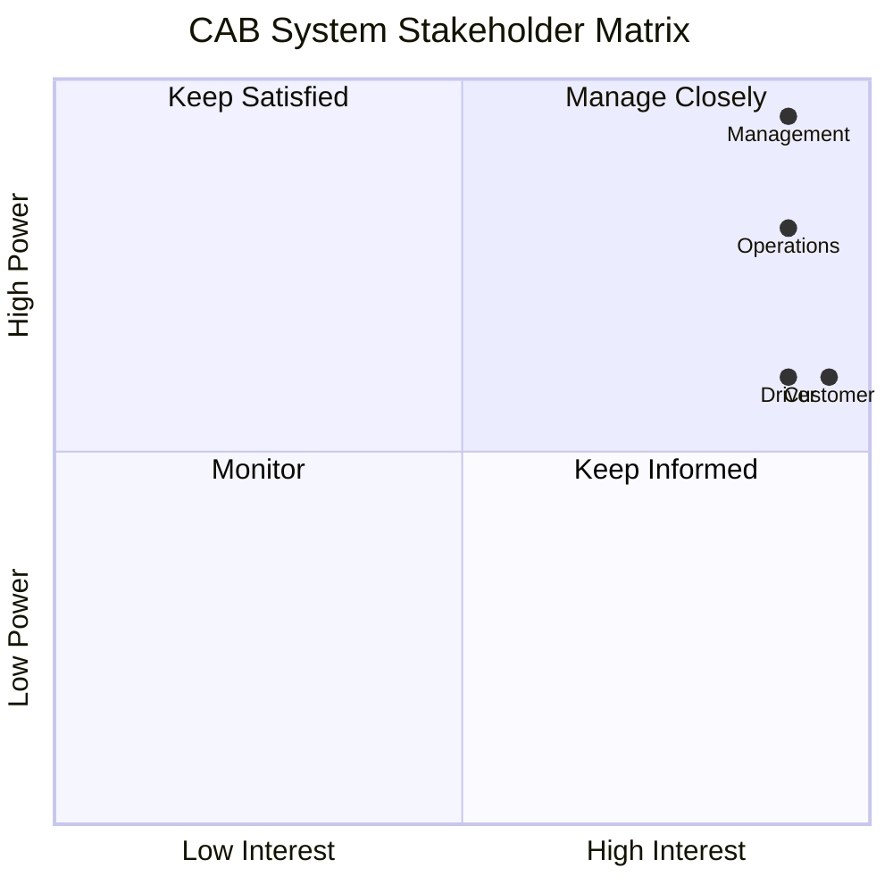
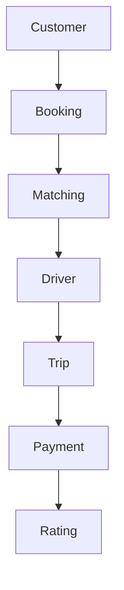

# 🚖 CAB System

### Online Ride Booking Platform

**Business Analysis Project – Industrial University of Ho Chi Minh City**

---

## 📖 Overview

CAB System là nền tảng đặt xe trực tuyến nhằm tự động hóa toàn bộ quy trình từ khi khách hàng tạo yêu cầu đặt xe đến khi chuyến đi hoàn thành, thanh toán và đánh giá tài xế.

### Mục tiêu

- Tự động tìm và phân công tài xế.
- Theo dõi chuyến đi theo thời gian thực.
- Hỗ trợ thanh toán tiền mặt và điện tử.
- Quản lý tập trung khách hàng, tài xế và chuyến đi.
- Khả năng mở rộng trong tương lai.

---

## 📑 Table of Contents

- Stakeholder Analysis
- Business Process
- Business Requirements
- Functional Requirements
- Use Case
- Business Rules
- Testing
- Roadmap

---

# 👥 Stakeholders

| Stakeholder | Vai trò |
|-------------|----------|
| Management | Định hướng dự án |
| Customer | Đặt xe |
| Driver | Thực hiện chuyến |
| Operations Staff | Quản lý vận hành |
| Administrator | Quản trị hệ thống |

---

# 📊 Stakeholder Matrix

---

# 🔄 Business Process

---

# 🚀 MVP Scope

| Module | Status |
|---------|--------|
| Account | ✅ |
| Booking | ✅ |
| Driver Matching | ✅ |
| Trip | ✅ |
| Payment | ✅ |
| Notification | ✅ |
| Operations | ✅ |

---

# 📚 Documentation

| Document | Location |
|----------|----------|
| Stakeholder Analysis | docs/requirements/stakeholder_analysis.md |
| Business Requirements | docs/requirements/business_requirements.md |
| Functional Requirements | docs/requirements/functional_requirements.md |
| Business Rules | docs/requirements/business_rules.md |
| Business Process | docs/design/business_process.md |
| Use Case Diagram | docs/design/usecase_diagram.md |
| Use Case Specification | docs/design/usecase_specification.md |
| Test Cases | docs/testing/test_case.md |

---

# 📅 Roadmap

| Week | Module |
|------|--------|
| 1 | Account |
| 2 | Driver |
| 3 | Booking |
| 4 | Matching |
| 5 | Payment |
| 6 | Notification |
| 7 | Testing |

---

# 👨‍💻 Student

**Bùi Thị Diễm My**

Industrial University of Ho Chi Minh City
