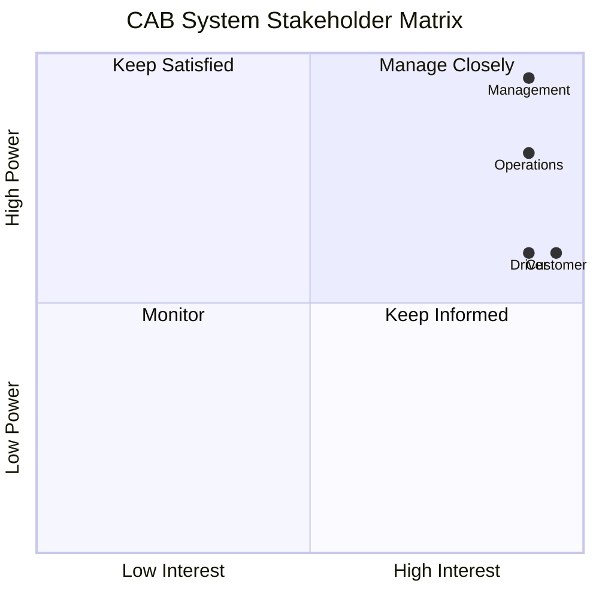
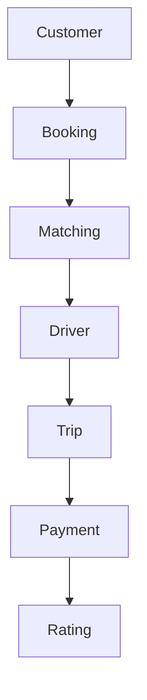
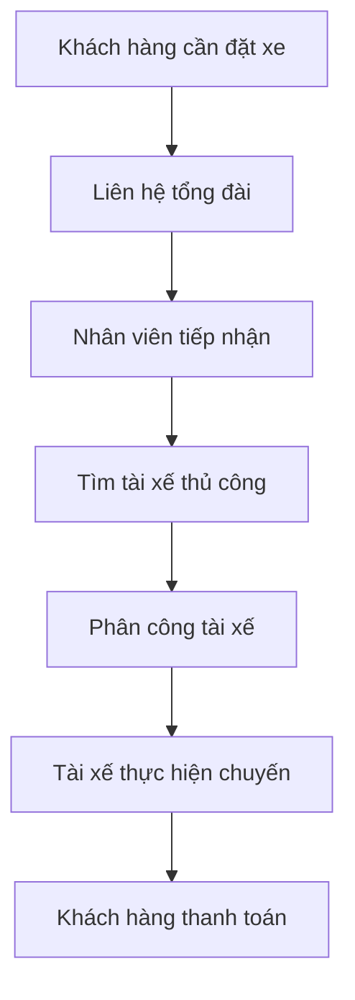
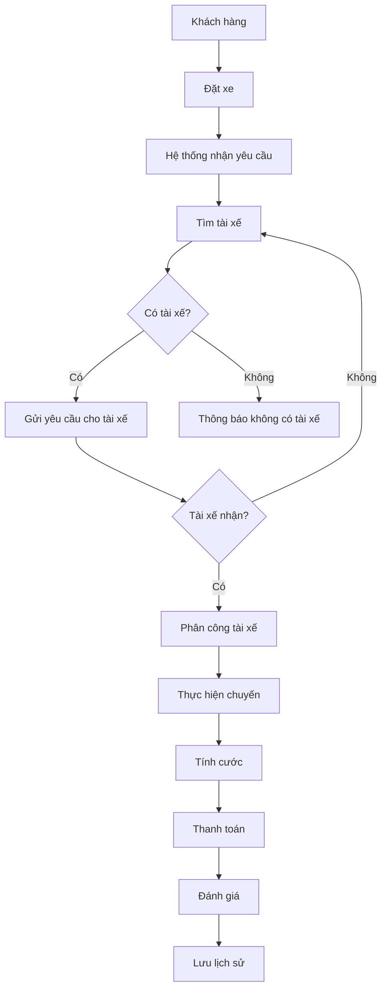
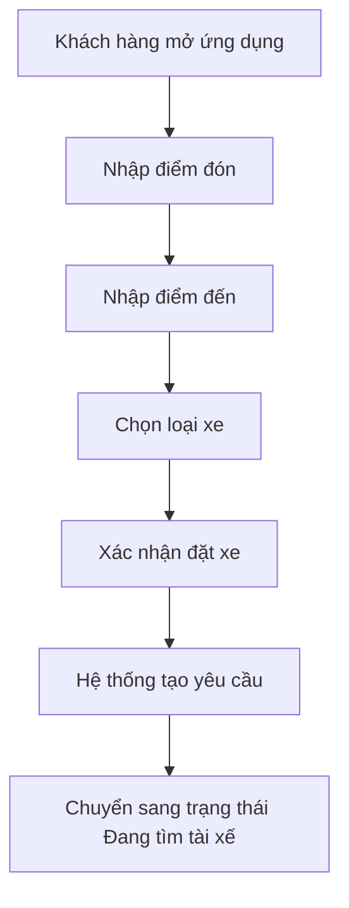
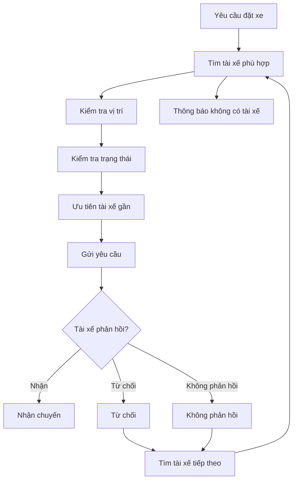
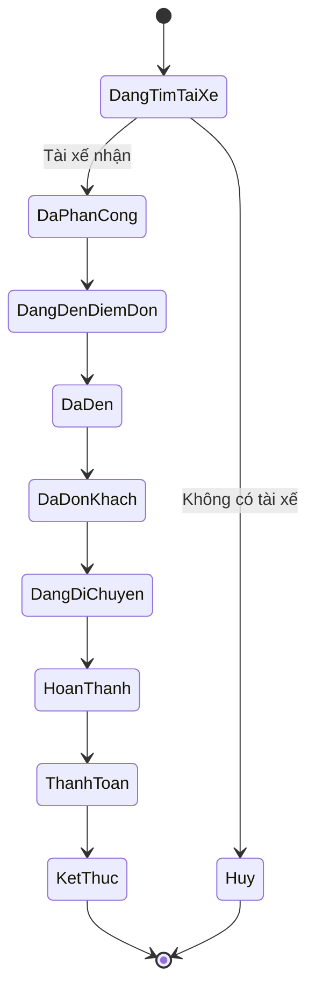
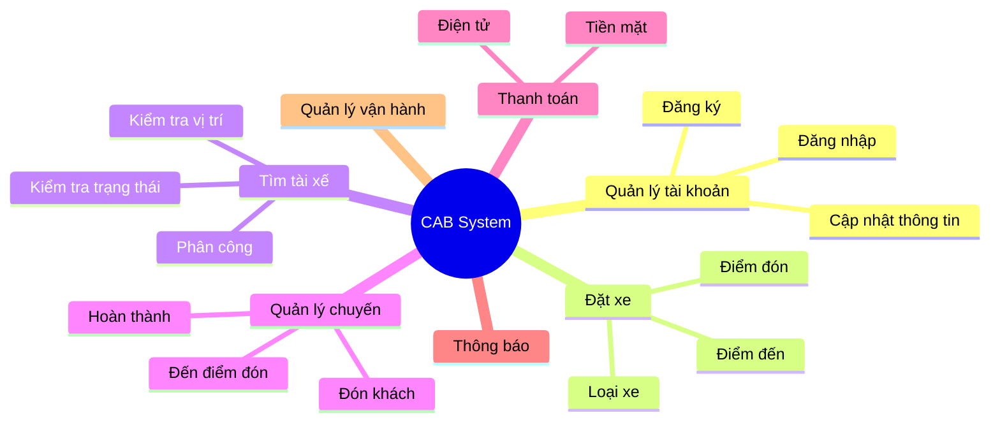
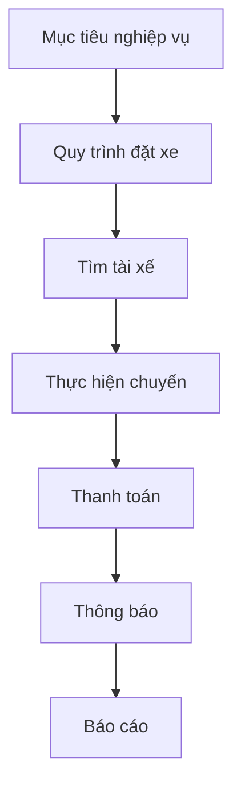

<div align="center">

# 🚖 CAB System

### Online Ride Booking Platform

**Business Analysis Project – Industrial University of Ho Chi Minh City**


</div>

---

## 📖 Overview

CAB System là nền tảng đặt xe trực tuyến nhằm tự động hóa toàn bộ quy trình từ khi khách hàng tạo yêu cầu đặt xe đến khi chuyến đi hoàn thành, thanh toán và đánh giá tài xế.

### Mục tiêu

- Tự động tìm và phân công tài xế.
- Theo dõi chuyến đi theo thời gian thực.
- Hỗ trợ thanh toán tiền mặt và điện tử.
- Quản lý tập trung khách hàng, tài xế và chuyến đi.
- Khả năng mở rộng trong tương lai.

---

## 📑 Table of Contents

- Stakeholder Analysis
- Business Process
- Business Requirements
- Functional Requirements
- Use Case
- Business Rules
- Testing
- Roadmap

---

# 👥 Stakeholders

| Stakeholder | Vai trò |
|-------------|----------|
| Management | Định hướng dự án |
| Customer | Đặt xe |
| Driver | Thực hiện chuyến |
| Operations Staff | Quản lý vận hành |
| Administrator | Quản trị hệ thống |

---

# 📊 Stakeholder Matrix



---

# 🔄 Business Process



---

# 🚀 MVP Scope

| Module | Status |
|---------|--------|
| Account | ✅ |
| Booking | ✅ |
| Driver Matching | ✅ |
| Trip | ✅ |
| Payment | ✅ |
| Notification | ✅ |
| Operations | ✅ |

---

# 📚 Documentation

| Document | Location |
|----------|----------|
| Stakeholder Analysis | docs/requirements/stakeholder_analysis.md |
| Business Requirements | docs/requirements/business_requirements.md |
| Functional Requirements | docs/requirements/functional_requirements.md |
| Business Rules | docs/requirements/business_rules.md |
| Business Process | docs/design/business_process.md |
| Use Case Diagram | docs/design/usecase_diagram.md |
| Use Case Specification | docs/design/usecase_specification.md |
| Test Cases | docs/testing/test_case.md |

---

# 📅 Roadmap

| Week | Module |
|------|--------|
| 1 | Account |
| 2 | Driver |
| 3 | Booking |
| 4 | Matching |
| 5 | Payment |
| 6 | Notification |
| 7 | Testing |

---
# Quy trình nghiệp vụ – CAB System

> Tài liệu mô tả quy trình nghiệp vụ của hệ thống CAB, từ quy trình hiện tại đến quy trình đề xuất cho phiên bản MVP 7 tuần.

---

## Mục lục

- Mục tiêu nghiệp vụ
- Quy trình hiện tại (AS-IS)
- Quy trình đề xuất (TO-BE)
- Quy trình đặt xe
- Quy trình tìm và phân công tài xế
- Trạng thái chuyến đi
- Nhóm chức năng của hệ thống
- So sánh AS-IS và TO-BE
- Tóm tắt

---

# 1. Mục tiêu nghiệp vụ

Hệ thống **CAB System** được xây dựng nhằm tự động hóa toàn bộ quy trình đặt xe, từ khi khách hàng tạo yêu cầu đến khi chuyến đi hoàn thành.

### Mục tiêu chính

- Giảm việc phân công tài xế thủ công.
- Rút ngắn thời gian xử lý yêu cầu.
- Giúp khách hàng theo dõi chuyến đi dễ dàng.
- Quản lý tập trung khách hàng, tài xế và chuyến đi.
- Hỗ trợ thanh toán và thông báo.
- Dễ mở rộng trong tương lai.

---

# 2. Quy trình hiện tại (AS-IS)

Hiện nay quy trình còn phụ thuộc nhiều vào nhân viên vận hành.



## Hạn chế

| Vấn đề | Ảnh hưởng |
|---------|-----------|
| Tìm tài xế thủ công | Mất thời gian |
| Khó theo dõi chuyến | Khách hàng thiếu thông tin |
| Quản lý giao dịch rời rạc | Khó kiểm soát |
| Phụ thuộc nhân viên | Chi phí vận hành cao |
| Khó mở rộng | Không đáp ứng khi số lượng người dùng tăng |

---

# 3. Quy trình đề xuất (TO-BE)

Hệ thống sẽ tự động xử lý phần lớn các bước.



### Điểm cải tiến

- Tự động tìm tài xế.
- Tự động phân công.
- Theo dõi chuyến theo thời gian thực.
- Quản lý thanh toán tập trung.

---

# 4. Quy trình đặt xe



### Kết quả mong đợi

- Yêu cầu được tạo thành công.
- Hệ thống bắt đầu tìm tài xế.
- Khách hàng nhận được thông báo.

---

# 5. Quy trình tìm và phân công tài xế

Đây là quy trình quan trọng nhất của hệ thống.



### Quy tắc xử lý

- Chỉ tài xế đang sẵn sàng mới được nhận chuyến.
- Nếu tài xế từ chối, hệ thống tìm người khác.
- Nếu tài xế không phản hồi, hệ thống tiếp tục tìm.
- Nếu không còn tài xế phù hợp, khách hàng được thông báo.

---

# 6. Trạng thái chuyến đi

Mỗi chuyến đi sẽ thay đổi trạng thái theo từng bước.



### Ý nghĩa từng trạng thái

| Trạng thái | Mô tả |
|------------|------|
| Đang tìm tài xế | Hệ thống đang tìm người phù hợp |
| Đã phân công | Có tài xế nhận chuyến |
| Đang đến điểm đón | Tài xế đang di chuyển |
| Đã đến | Tài xế đến nơi |
| Đã đón khách | Bắt đầu chuyến đi |
| Đang di chuyển | Chuyến đang diễn ra |
| Hoàn thành | Kết thúc chuyến |
| Thanh toán | Xử lý giao dịch |
| Kết thúc | Hoàn tất |

---

# 7. Nhóm chức năng của hệ thống



---

# 8. So sánh quy trình hiện tại và quy trình đề xuất

| Quy trình hiện tại | Quy trình đề xuất |
|-------------------|------------------|
| Gọi tổng đài | Đặt xe trên hệ thống |
| Tìm tài xế thủ công | Tự động tìm tài xế |
| Khó theo dõi | Theo dõi thời gian thực |
| Phân công thủ công | Tự động phân công |
| Thanh toán rời rạc | Quản lý tập trung |
| Khó mở rộng | Dễ mở rộng |

---

# 9. Mối liên hệ giữa nghiệp vụ và hệ thống



---

# 10. Tóm tắt

Phiên bản MVP tập trung vào quy trình cốt lõi:

```text
Đặt xe
   ↓
Tìm tài xế
   ↓
Phân công
   ↓
Thực hiện chuyến
   ↓
Tính cước
   ↓
Thanh toán
   ↓
Đánh giá
```

Quy trình này giúp giảm thao tác thủ công, tăng tốc độ xử lý và tạo nền tảng để mở rộng hệ thống trong tương lai.

# 👨‍💻 Student

**Bùi Thị Diễm My**

Industrial University of Ho Chi Minh City
