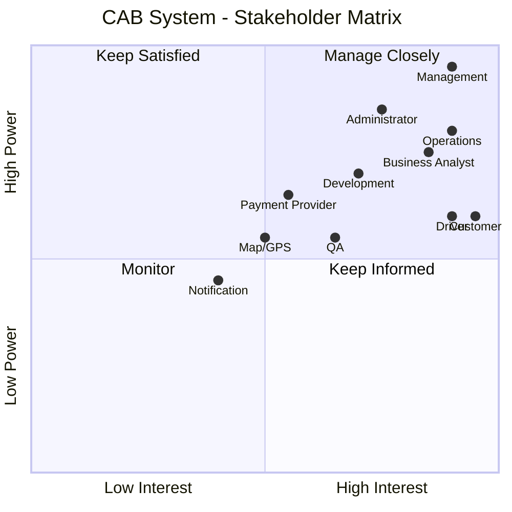
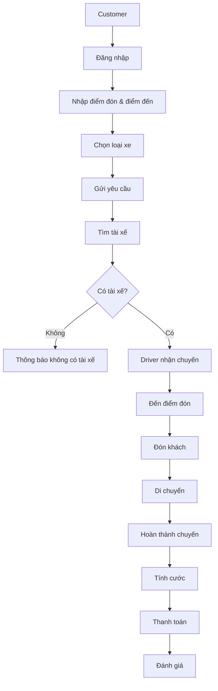
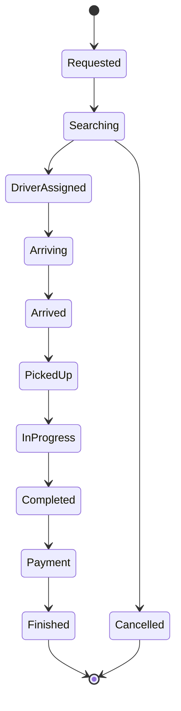
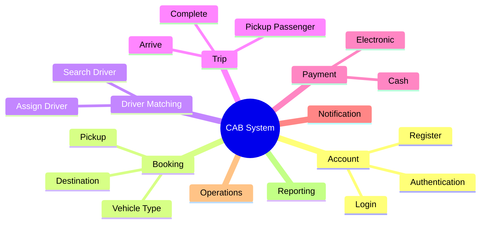

# 🚖 CAB System

<div align="center">

# CAB System – Online Ride Booking Platform

**Business Analysis Project (IUH) – MVP 7 Weeks**


</div>

---

## 📌 Overview

CAB System là nền tảng đặt xe trực tuyến được xây dựng nhằm **tự động hóa toàn bộ quy trình đặt xe**, từ khi khách hàng tạo yêu cầu đến khi chuyến đi hoàn thành, thanh toán và đánh giá tài xế.

### Mục tiêu chính

- Tự động tìm và phân công tài xế.
- Cho phép khách hàng theo dõi chuyến đi theo thời gian thực.
- Hỗ trợ thanh toán tiền mặt và điện tử.
- Quản lý tập trung khách hàng, tài xế và chuyến đi.
- Hỗ trợ mở rộng hệ thống trong tương lai.

---

## 📑 Table of Contents

- [Stakeholders](#-stakeholders)
- [Stakeholder Matrix](#-stakeholder-matrix)
- [Business Objectives](#-business-objectives)
- [Business Process](#-business-process)
- [MVP Scope](#-mvp-scope-7-weeks)
- [Functional Modules](#-functional-modules)
- [Documentation Hub](#-documentation-hub)
- [Project Structure](#-project-structure)
- [Roadmap](#-roadmap-7-weeks)
- [Team](#-team)

---

# 👥 Stakeholders

| Stakeholder | Vai trò |
|-------------|---------|
| Management | Định hướng và phê duyệt dự án |
| Customer | Đặt xe, thanh toán, theo dõi chuyến |
| Driver | Nhận chuyến và thực hiện chuyến đi |
| Operations Staff | Quản lý vận hành |
| Administrator | Quản trị hệ thống |
| Business Analyst | Thu thập và phân tích yêu cầu |
| Development Team | Xây dựng hệ thống |
| QA/Tester | Kiểm thử hệ thống |
| Payment Provider | Thanh toán điện tử |
| Map & GPS Provider | Định vị |
| Notification Provider | Gửi thông báo |

---

# 📊 Stakeholder Matrix



---

# 🎯 Business Objectives

- Tự động hóa quy trình đặt xe.
- Tìm tài xế nhanh và chính xác.
- Quản lý toàn bộ vòng đời chuyến đi.
- Theo dõi trạng thái chuyến theo thời gian thực.
- Hỗ trợ thanh toán và thông báo.
- Quản lý vận hành tập trung.
- Đảm bảo bảo mật và khả năng mở rộng.

---

# 🔄 Business Process

## Quy trình tổng quan



---

## Trạng thái chuyến đi



---

# 🚀 MVP Scope (7 Weeks)

## In Scope

| Module | Chức năng |
|---------|-----------|
| Account | Đăng ký, đăng nhập |
| Booking | Đặt xe |
| Driver Matching | Tìm và phân công tài xế |
| Trip | Cập nhật trạng thái chuyến |
| Tracking | Theo dõi chuyến |
| Payment | Tiền mặt & điện tử |
| Notification | Thông báo |
| Rating | Đánh giá tài xế |
| Operations | Quản lý vận hành |
| Security | Phân quyền & Audit Log |

## Out of Scope

- Voucher
- Loyalty
- Chat
- Đặt xe theo lịch
- AI tối ưu phân công
- Đa quốc gia
- Nhiều phương thức thanh toán

---

# 🧩 Functional Modules



| Module | Functional Requirements |
|---------|-------------------------|
| FR01 | Account Management |
| FR02 | Customer Management |
| FR03 | Driver Management |
| FR04 | Ride Booking |
| FR05 | Driver Matching |
| FR06 | Trip Management |
| FR07 | Payment |
| FR08 | Notification |
| FR09 | Rating |
| FR10 | Operations |
| FR11 | Reporting |
| FR12 | Security |
| FR13 | Location |

---

# 📚 Documentation Hub

## Requirements

| Tài liệu | Nội dung |
|----------|----------|
| Business Requirements | BR01 – BR14 |
| Functional Requirements | FR01 – FR13 |
| Business Process | Quy trình nghiệp vụ |
| Stakeholder Analysis | Stakeholder Matrix |

## Design

| Tài liệu | Nội dung |
|----------|----------|
| Use Case Diagram | Tổng quan Use Case |
| Use Case Specification | Đặc tả Use Case |
| Activity Diagram | Quy trình hoạt động |
| State Diagram | Trạng thái chuyến đi |

## Testing

| Tài liệu | Nội dung |
|----------|----------|
| Test Scenario | Kịch bản kiểm thử |
| Test Case | Test Case chi tiết |
| Traceability Matrix | BR → FR → UC → TC |

---

# 📁 Project Structure

```text
23638831_BuiThiDiemMy_cabsystem/
│
├── README.md
├── docs/
│   ├── requirements/
│   │   ├── business_requirements.md
│   │   ├── functional_requirements.md
│   │   └── stakeholder_analysis.md
│   │
│   ├── design/
│   │   ├── usecase.md
│   │   ├── activity_diagram.md
│   │   └── state_diagram.md
│   │
│   ├── testing/
│   │   ├── test_scenario.md
│   │   ├── test_case.md
│   │   └── traceability_matrix.md
│   │
│   └── diagrams/
│       └── mermaid/
│
└── src/
```

---

# 📅 Roadmap (7 Weeks)

| Week | Module |
|------|--------|
| Week 1 | Account Management |
| Week 2 | Driver Management |
| Week 3 | Ride Booking |
| Week 4 | Driver Matching & Trip |
| Week 5 | Payment |
| Week 6 | Notification & Operations |
| Week 7 | Testing & Deployment |

---

# 📊 Business → Functional Mapping

| Business Requirement | Functional Requirement |
|----------------------|------------------------|
| BR01 | FR01, FR04 |
| BR02 | FR03, FR05 |
| BR04 | FR04, FR06 |
| BR05 | FR06, FR08, FR13 |
| BR06 | FR07 |
| BR08 | FR08 |
| BR09 | FR10 |
| BR10 | FR12 |
| BR11 | FR11 |
| BR12 | FR12 |

---

# 👨‍💻 Team

| Thông tin | Giá trị |
|------------|---------|
| Student | **Bùi Thị Diễm My** |
| Project | CAB System |
| Course | Business Analysis |
| University | Industrial University of Ho Chi Minh City |

---

<div align="center">

### 🚖 CAB System

*Business Analysis Project – IUH*

⭐ Designed with GitHub Markdown & Mermaid

</div>
